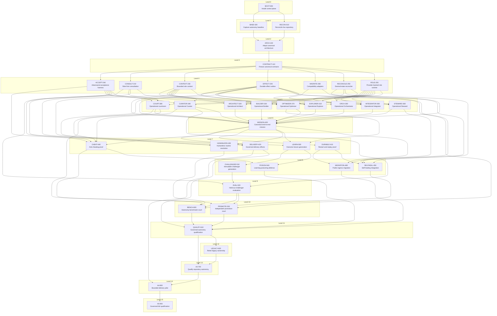

# Verifiable Hive Cortex Implementation Levels

- **Plan:** `hive-mind-os-verifiable-hive-cortex-v1`
- **Plan fingerprint:** `sha256:9769f9796efb351da9b764fd49983b1130adccc0b8592e42581714d3727f8b39`
- **Original baseline:** `7e1d4d83ace334463fa8d3caa5f4c1d617bc2c23`
- **Nodes:** 39
- **Dependency levels:** 16

Current repository state must always be reconciled before dispatch. A level number is a dependency layer, not permission to start every node automatically. The dispatcher may release only nodes whose dependencies are integrated, receipts validate, and file/semantic locks do not conflict.

## Level graph

## Dispatch levels

| Level | Nodes | Start gate | Worker stop gate |
|---:|---|---|---|
| 0 | `BOOT-000` | Current `main` inspected; bootstrap branch created from exact head. | Each node opens its own draft PR with a validated receipt; no worker merges or starts downstream work. |
| 1 | `BASE-020` `RECON-010` | Integrated validated receipts for `BOOT-000`. | Each node opens its own draft PR with a validated receipt; no worker merges or starts downstream work. |
| 2 | `ARCH-100` | Integrated validated receipts for `BASE-020`, `RECON-010`. | Each node opens its own draft PR with a validated receipt; no worker merges or starts downstream work. |
| 3 | `CONTRACT-110` | Integrated validated receipts for `ARCH-100`. | Each node opens its own draft PR with a validated receipt; no worker merges or starts downstream work. |
| 4 | `ACCEPT-240` `CONSULT-210` `CONTEXT-230` `EFFECT-220` `MIGRATE-260` `RECONCILE-250` `ROLE-200` | Integrated validated receipts for `CONTRACT-110`. | Each node opens its own draft PR with a validated receipt; no worker merges or starts downstream work. |
| 5 | `ARCHITECT-320` `BUILDER-330` `COURT-380` `CURATOR-340` `EXPLORER-310` `INTEGRATOR-350` `OPTIMIZER-370` `ORCH-300` `STEWARD-360` | Integrated validated receipts for `ACCEPT-240`, `CONSULT-210`, `CONTEXT-230`, `EFFECT-220`, `MIGRATE-260`, `RECONCILE-250`, `ROLE-200`. | Each node opens its own draft PR with a validated receipt; no worker merges or starts downstream work. |
| 6 | `MISSION-400` | Integrated validated receipts for `ARCHITECT-320`, `BUILDER-330`, `CONTEXT-230`, `COURT-380`, `CURATOR-340`, `EFFECT-220`, `EXPLORER-310`, `INTEGRATOR-350`, `OPTIMIZER-370`, `ORCH-300`, `RECONCILE-250`, `STEWARD-360`. | Each node opens its own draft PR with a validated receipt; no worker merges or starts downstream work. |
| 7 | `CHEAT-440` `DELIVERY-420` `DURABLE-410` `HUMANLESS-430` `LEARN-500` | Integrated validated receipts for `ACCEPT-240`, `CONSULT-210`, `CONTEXT-230`, `COURT-380`, `CURATOR-340`, `EFFECT-220`, `MISSION-400`, `OPTIMIZER-370`. | Each node opens its own draft PR with a validated receipt; no worker merges or starts downstream work. |
| 8 | `CHALLENGER-510` `MIGRATION-460` `POISON-540` `SELFHEAL-450` | Integrated validated receipts for `CHEAT-440`, `DURABLE-410`, `EFFECT-220`, `LEARN-500`, `MIGRATE-260`, `MISSION-400`, `RECONCILE-250`, `STEWARD-360`. | Each node opens its own draft PR with a validated receipt; no worker merges or starts downstream work. |
| 9 | `EVAL-520` | Integrated validated receipts for `ACCEPT-240`, `CHALLENGER-510`, `CURATOR-340`. | Each node opens its own draft PR with a validated receipt; no worker merges or starts downstream work. |
| 10 | `BENCH-600` `PROMOTE-530` | Integrated validated receipts for `CHEAT-440`, `COURT-380`, `EFFECT-220`, `EVAL-520`, `HUMANLESS-430`, `SELFHEAL-450`. | Each node opens its own draft PR with a validated receipt; no worker merges or starts downstream work. |
| 11 | `QUALIFY-610` | Integrated validated receipts for `BENCH-600`, `DELIVERY-420`, `MIGRATION-460`, `POISON-540`, `PROMOTE-530`. | Each node opens its own draft PR with a validated receipt; no worker merges or starts downstream work. |
| 12 | `LEGACY-620` | Integrated validated receipts for `QUALIFY-610`. | Each node opens its own draft PR with a validated receipt; no worker merges or starts downstream work. |
| 13 | `A3-700` | Integrated validated receipts for `LEGACY-620`, `QUALIFY-610`. | Each node opens its own draft PR with a validated receipt; no worker merges or starts downstream work. |
| 14 | `A4-800` | Integrated validated receipts for `A3-700`, `DELIVERY-420`. | Each node opens its own draft PR with a validated receipt; no worker merges or starts downstream work. |
| 15 | `A5-900` | Integrated validated receipts for `A4-800`. | Each node opens its own draft PR with a validated receipt; no worker merges or starts downstream work. |

## Immediate transition after this bootstrap PR merges

Run **two separate sessions in parallel**:

- `RECON-010` — live repository, PR, branch, CI, and plan reconciliation.
- `BASE-020` — clean test, runtime-call-path, role-wiring, and provider baseline.

Do not start `ARCH-100` until both Level 1 PRs are merged and a fresh dispatcher run validates their receipts against the then-current `main`.
