# Whole-OS N00-N33 status DAG

Reconciled on 2026-09-21. PR #203 is the integrated baseline at
`main@ed96ffde57304d6b1ab7923e4d219640ac96b44f`. ADR-090 selects two generic
repositories for N32. ADR-091 makes bounded production and full-autonomy or
superiority alternative claim paths; arrows within each path are conjunctive.

Legend: green = repository implementation and exact-candidate checks complete; blue =
successor validation/integration in progress; amber = implementation exists but a
production-strength claim lacks real qualification; red = execution cannot begin or
finish without listed external input; gray = dependent outcome closeout has not begun.

```mermaid
flowchart LR
  N00["N00 reconcile"] --> N01["N01 compile decisions"] --> N02["N02 freeze protocol"]
  N02 --> N03["N03 host/profile evidence"] --> N04["N04 subject authority"]
  N04 --> N05["N05 context"] --> N06["N06 cache"] --> N07["N07 route qualification"]
  N07 --> N08["N08 durable bindings"] --> N09["N09 outcome graph"]
  N09 --> N10["N10 campaign service"] --> N11["N11 discovery"] --> N12["N12 roles"]
  N12 --> N13["N13 builder"] --> N14["N14 qualification"] --> N15["N15 delivery"]
  N15 --> N16["N16 feedback/repair"] --> N17["N17 self-upgrade"]
  N03 --> N18["N18 hard isolation"]
  N04 --> N18
  N05 --> N19["N19 tenant memory"]
  N18 --> N19 --> N20["N20 lesson drafts"] --> N21["N21 lesson delivery"]
  N15 --> N21
  N21 --> N22["N22 endpoint curriculum"] --> N23["N23 evaluator custody"]
  N23 --> N24["N24 functional evaluation"] --> N25["N25 scoped learning"]
  N03 --> N26["N26 Roblox static profile"]
  N18 --> N26
  N22 --> N26 --> N27["N27 Roblox runtime evidence"]
  N15 --> N27
  N24 --> N27
  N13 --> N28["N28 lifecycle composition"]
  N14 --> N28
  N16 --> N28
  N21 --> N28
  N25 --> N28
  N26 --> N28
  N17 --> N29["N29 adversarial qualification"]
  N18 --> N29
  N21 --> N29
  N23 --> N29
  N28 --> N29
  N02 --> N30["N30 measured tournament"]
  N28 --> N30
  N29 --> N30
  N17 --> N31["N31 72h self pilot (full)"]
  N30 --> N31
  N21 --> N32B["N32 72h external pilot (bounded)"]
  N28 --> N32B
  N29 --> N32B
  N03 --> N32B
  N04 --> N32B
  N21 --> N32F["N32 72h external pilot (full)"]
  N30 --> N32F
  N32B --> N33B["N33 bounded closeout"]
  N31 --> N33F["N33 full closeout"]
  N32F --> N33F
  N28 --> QMAIN["PR #203 merged + full CI"]
  N30 --> QLOCAL["successor integration + full CI"]
  N31 --> QLOCAL
  N32F --> QLOCAL
  N32B --> QLOCAL

  classDef done fill:#1f883d,color:#fff,stroke:#116329,stroke-width:2px;
  classDef running fill:#0969da,color:#fff,stroke:#0550ae,stroke-width:2px;
  classDef partial fill:#bf8700,color:#fff,stroke:#9a6700,stroke-width:2px;
  classDef blocked fill:#cf222e,color:#fff,stroke:#a40e26,stroke-width:2px;
  classDef pending fill:#6e7781,color:#fff,stroke:#57606a,stroke-width:2px;

  class N00,N01,N02,N04,N05,N06,N07,N08,N09,N10,N11,N12,N13,N14,N15,N16,N17,N19,N20,N21,N22,N24,N25,N26,N28,QMAIN done;
  class QLOCAL running;
  class N03,N18,N23,N27,N29 partial;
  class N30,N31,N32B,N32F blocked;
  class N33B,N33F pending;
```

## Exact remaining external inputs

- N03/N18/N23/N29: an attested configured host with hard tenant isolation, egress and
  secret probes, evaluator custody, and an independent exact-candidate execution.
- N30: concrete comparator recipe/task/family/block manifests; source/reuse rights;
  independent evaluator custody; authenticated admission registry and bounded lease.
- N31 (full scope): sealed Whole-OS host/config, scoped self-delivery grant, external
  supervisor champion pointer and rollback artifact, an admitted N30 candidate, and
  its 72-hour window with three accepted nontrivial changes.
- N32 bounded: an independently qualified exact production candidate; candidate-bound
  host; two owner-admitted external targets with pinned snapshots, rights, acceptance
  and runtime profiles; target grants and resource/cleanup leases; real target runtime
  receipts; and the 72-hour window with restart and rollback.
- N32 full: every bounded input plus an admitted N30 candidate.
- N33 bounded: adopted N28/N29/N32 evidence and the independent closeout mapping.
- N33 full: completed N30/N31/N32 evidence and the independent closeout mapping.

For bounded scope, the deterministic resume action is to qualify the exact successor,
seal its host, authority, target, and runtime receipts, then start N32 with
`-ClaimScope bounded-operational-production-pilot`. Full scope must additionally
close N30 and N31. No checked-in document, ambient credential, fixture verifier, or
installed binary can manufacture those inputs.
