# Whole-OS N00-N33 status DAG

Observed on 2026-09-14. The implementation candidate is PR #186, based directly on
`main@428af931342820d8f7350bf0f7664115b6257302`.

Legend: green = repository implementation and deterministic checks complete; blue =
candidate-wide CI required/in progress; amber = implementation exists but real external
qualification evidence is unavailable; red = cannot begin or finish without the
listed external input; gray = dependent observation/closeout has not started.

```mermaid
flowchart LR
  N00["N00 reconcile"] --> N01["N01 compile decisions"] --> N02["N02 freeze protocol"]
  N02 --> N03["N03 host/profile evidence"] --> N04["N04 subject authority"]
  N04 --> N05["N05 context"] --> N06["N06 cache"] --> N07["N07 route qualification"]
  N07 --> N08["N08 durable bindings"] --> N09["N09 outcome graph"]
  N09 --> N10["N10 campaign service"] --> N11["N11 discovery"] --> N12["N12 roles"]
  N12 --> N13["N13 builder"] --> N14["N14 qualification"] --> N15["N15 delivery"]
  N15 --> N16["N16 feedback/repair"] --> N17["N17 self-upgrade"]
  N03 --> N18["N18 hard isolation"]
  N04 --> N18
  N05 --> N19["N19 tenant memory"]
  N18 --> N19 --> N20["N20 lesson drafts"] --> N21["N21 lesson delivery"]
  N15 --> N21
  N21 --> N22["N22 endpoint curriculum"] --> N23["N23 evaluator custody"]
  N23 --> N24["N24 functional evaluation"] --> N25["N25 scoped learning"]
  N03 --> N26["N26 Roblox static profile"]
  N18 --> N26
  N22 --> N26 --> N27["N27 Roblox runtime evidence"]
  N15 --> N27
  N24 --> N27
  N13 --> N28["N28 lifecycle composition"]
  N14 --> N28
  N16 --> N28
  N21 --> N28
  N25 --> N28
  N26 --> N28
  N17 --> N29["N29 adversarial qualification"]
  N18 --> N29
  N21 --> N29
  N23 --> N29
  N28 --> N29
  N02 --> N30["N30 measured tournament"]
  N28 --> N30
  N29 --> N30
  N17 --> N31["N31 72h self pilot"]
  N30 --> N31
  N21 --> N32["N32 72h external/Roblox pilot"]
  N27 --> N32
  N30 --> N32
  N31 --> N33["N33 outcome closeout"]
  N32 --> N33
  N28 --> QCI["PR #186 full CI"]

  classDef done fill:#1f883d,color:#fff,stroke:#116329,stroke-width:2px;
  classDef running fill:#0969da,color:#fff,stroke:#0550ae,stroke-width:2px;
  classDef partial fill:#bf8700,color:#fff,stroke:#9a6700,stroke-width:2px;
  classDef blocked fill:#cf222e,color:#fff,stroke:#a40e26,stroke-width:2px;
  classDef pending fill:#6e7781,color:#fff,stroke:#57606a,stroke-width:2px;

  class N00,N01,N02,N04,N05,N06,N07,N08,N09,N10,N11,N12,N13,N14,N15,N16,N17,N19,N20,N21,N22,N24,N25,N26,N28 done;
  class QCI running;
  class N03,N18,N23,N27,N29 partial;
  class N30,N31,N32 blocked;
  class N33 pending;
```

## Exact remaining external inputs

- N03/N18/N23/N29: an attested configured host with hard tenant isolation, egress and
  secret probes, evaluator custody, and an independent exact-candidate execution.
- N30: concrete comparator recipe/task/family/block manifests; source/reuse rights;
  independent evaluator custody; authenticated admission registry and bounded lease.
- N31: sealed Whole-OS host/config, scoped self-delivery grant, external supervisor
  champion pointer and rollback artifact, an admitted N30 candidate, and its 72-hour
  window with three accepted nontrivial changes.
- N32: owner-admitted ordinary and Roblox targets; rights-cleared brief/assets/data;
  Studio/Player multi-client, persistence, security, network and device harnesses;
  target grants and resource/cleanup leases; admitted N30 candidate; 72-hour window.
- N33: the completed N31/N32 outcome windows and final independent closeout mapping.

The deterministic resume action is to inject those sealed capabilities into the
configured composition host, close and admit the N02 protocol through the external
registry, run the N30 runner, then start N31/N32. No checked-in document, ambient
credential, fixture verifier, or installed binary can manufacture those inputs.
