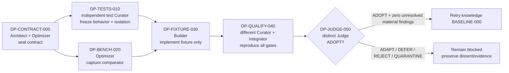

# Doctor Performance v1 DAG

This additive predecessor program addresses the doctor timeout recorded at commit
`6bc343f079be6f2d5fd6953d92099a8d5de872b1`. It does not implement the fixture and does
not unblock the knowledge DAG. The governing court disposition is `ADAPT`; all six nodes
remain `not_started` until separately executed and integrated.

## Dependency graph and roles



The compiled schedule is five rounds: contract alone; tests and benchmark in parallel;
fixture alone; qualification alone; court alone. The graph is acyclic. The retry is a
postcondition and intentionally is not a seventh node in this predecessor.

## Frozen boundary

The program preserves the exact doctor command, controller timeout, unittest discovery,
and complete unittest ID set with SHA-256
`7c0cf4ae7a2efca60af613b1702c97133a28b043bad09b231fe3a6c97d23eef4`.
On the cited host that is 381 total executions: 380 passes, the same one conditional skip,
zero failures, and zero errors. It also preserves test IDs, order, methods, assertions,
subtests, behavior constants, and skip decorators. Production code,
controller code, protected refs, `.autopilot/plan.json`, the knowledge DAG, and its
tournament bundle are forbidden.

`DP-FIXTURE-030` alone may write `.autopilot/tests/fixture_support.py` and the fixture
imports plus `HealingFixture.setUp`/`tearDown` in `.autopilot/tests/test_healing.py`.
Independent test authors own `tests/test_autopilot_fixture_seed.py` and
`tests/test_doctor_performance_contract.py`.

## Commands

```powershell
python docs/execution/dags/doctor-performance-v1/verify_plan.py --write
python .autopilot/bin/autopilot.py --repo-root . dag-lint --plan .autopilot/state/doctor-performance-v1.json --strict --json
python .autopilot/bin/autopilot.py --repo-root . dag-rounds --plan .autopilot/state/doctor-performance-v1.json --max-sessions 2 --actor codex:doctor-performance --json
python docs/execution/dags/doctor-performance-v1/benchmark.py self-test
```

`--write` materializes only ignored local state at
`.autopilot/state/doctor-performance-v1.json`. The verifier seals the ADR, court record,
README, generator, specifications, benchmark runner, and itself; verifies the authoring
standard and both immutable plans; checks node contract digests and exact graph edges;
and fails if `.autopilot/plan.json` or the knowledge plan bundle has changed.

The benchmark runner requires explicit output paths. Each runtime receipt uses at least
six fresh exact doctor processes, cold-first alternating declared cold/warm modes, at
least three cold trials, the unchanged internal 180-second timeout, and nearest-rank p95.
Candidate qualification requires every trial below 180 seconds and p95 at or below 135
seconds. Declared modes are labels, not claims that operating-system caches were purged.

## Gate sequence

1. `DP-CONTRACT-000` seals this proposed contract and remains non-production.
2. `DP-TESTS-010` freezes behavior and adversarial isolation independently.
3. `DP-BENCH-020` records the pinned comparator independently and may run with step 2.
4. `DP-FIXTURE-030` implements only after both predecessors integrate.
5. `DP-QUALIFY-040` runs the two new tests, focused fixture and healing discoveries,
   full `.autopilot/tests`, full `tests`, byte seals, confinement, and both-runtime trials.
6. `DP-JUDGE-050` binds one immutable candidate and may authorize the baseline retry
   only with `ADOPT` and no unresolved material finding.

Production/controller Git caching is deferred. No node in this DAG grants remote,
production, or policy authority.
