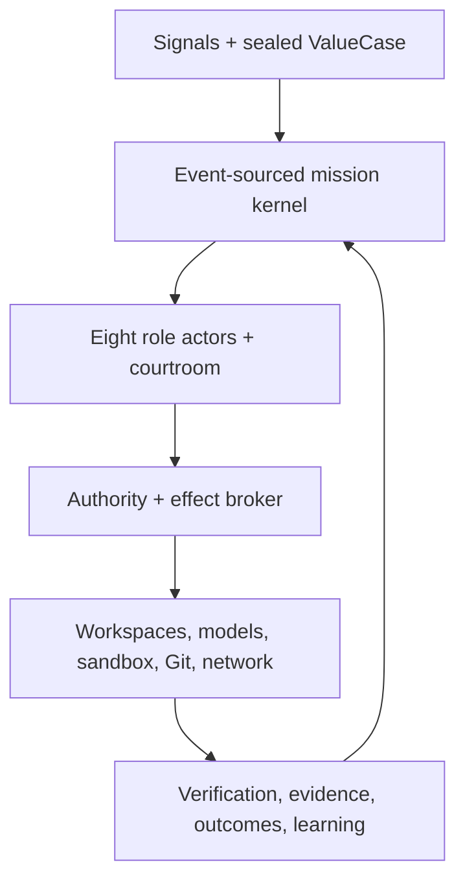
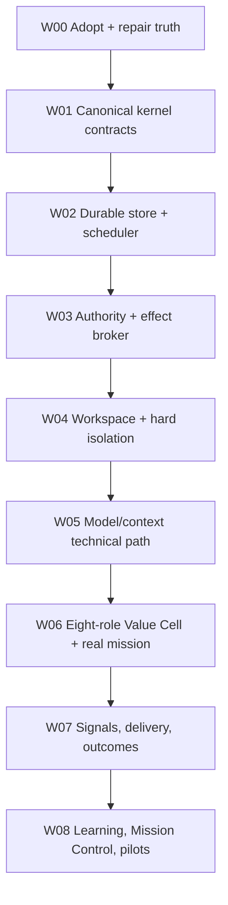

# Hive Mind OS — Full Systems Analysis and Canonical Execution Handoff

**Analysis snapshot:** 2026-08-06 (America/Chicago)

**Repository:** [kb4beast/hive-mind-os](https://github.com/kb4beast/hive-mind-os)

**Analyzed branch:** `main`

**Analyzed commit:** `56cdf8b7a25294a0e1fbe73d8f732575e8c6b9a2`

**Document status:** Proposed canonical execution plan; it becomes binding only when the repository owner adopts it through a uniquely numbered ADR, records the required constitutional court disposition, and merges that adoption into `main`.

**Intended executor:** A lower-capability implementation model with no prior conversation context.
**Program identifier:** `HMOS-C1` (Hive Mind OS Convergence Program 1). Do not reuse the old `P01`, `Phase 1`, or release-redesign phase names for new work.

---

## 1. Executive decision

Hive Mind OS is currently a **strong local verification product surrounded by several independently evolved prototypes**. It is not yet one autonomous product-engineering operating system.

The code is healthier than the architecture. The analyzed `main` is clean, its full local test suite passes, the offline demo works, and the immutable verifier is a substantial trustworthy asset. At the same time, four different orchestration paths compete for product ownership, capability claims are not generated from runtime truth, real model execution is not durably integrated, hard isolation is absent, five of eight roles are not operational in the repository mission, and no customer-outcome loop exists.

The correct next move is **convergence, not another subsystem**.

The reimagined product is a **Verified Value Cell OS**:

- One sealed customer-value case.
- One event-sourced mission history.
- One deterministic state reducer.
- One authority and effect-broker path.
- One immutable workspace and verification service.
- Eight accountable specialist roles arranged around customer value, not a ceremonial waterfall.
- Zero alternative “brains” that can write mission state or perform effects outside the kernel.

The product should support two honest entry points:

1. **Verify:** independently verify an existing immutable candidate against a pre-sealed acceptance contract.
2. **Run:** govern a bounded mission from a sealed value case through discovery, design, implementation, independent verification, authorized delivery, and later outcome observation.

Everything else—simulation, scheduling, GitHub delivery, point-in-time learning, experiments, projections, and future UI—must be a consumer or adapter of that same kernel.

### Bottom-line maturity verdict

| Area | Current evidence-backed maturity | Verdict |
|---|---|---|
| Immutable local candidate verification | `executable_local` | Strongest shipped capability; retain and harden. |
| Offline fixture delivery demo | `executable_fixture` | Works, but is intentionally not a general coding agent. |
| Structured model transport | `executed_real_provider` for one bounded turn | Subscription transport ran; the preserved result was adverse and not an E2E mission. |
| General model-driven repository repair | `structural` / partial local prototypes | Not durably integrated or independently reproduced. |
| Durable mission resume | `executable_local` for scripted missions | Real model-backed `RepositoryMission` explicitly cannot resume. |
| Scheduler and workers | `executable_local` for the legacy scripted path | Useful mechanics; not the scheduler for all current runtimes. |
| Remote branch / draft PR handling | `experimental` | Exists in `AutonomousBrain`, outside the canonical policy/verification path. |
| Eight-role operation | `structural` | Eight contracts exist; only Explorer, Builder, and Curator are operational in the shipped repository mission. |
| Hard hostile-code isolation | `planned` | Current sandbox is a process-control tier, not a hostile-code boundary. |
| Authenticated independent identities | `planned` | Local role labels and separate contexts are not external identity proof. |
| External append-only custody | `planned` | Local SQLite/files can detect some mutation but cannot survive privileged host rewrite/loss. |
| Product signals and customer outcomes | `planned` | No real signal intake, outcome contract, observation window, or value ledger is wired. |
| Champion/challenger improvement | `structural` / fixture | Safety ideas are good; causal real-world promotion is not demonstrated. |
| Production readiness or superiority | `planned` and blocked | No such claim is currently supportable. |

### The first five actions

1. Adopt one roadmap and freeze every other sequencing document as historical or reference-only.
2. Repair truth surfaces: capability registry, CLI, README, audit command, versions, ADR index, checkpoints, and branch disposition.
3. Build one event-sourced kernel and migrate all runtime entry points to it behind compatibility facades.
4. Put every effect—subprocess, filesystem mutation, Git write, network call, provider call, and remote action—behind one resource-aware effect broker.
5. After all eight role accountabilities are operational, run one authorized, bounded Codex-subscription repository mission through the canonical kernel and immutable verifier; preserve adverse evidence and require independent reproduction before promoting the claim.

---

## 2. Authority and plan precedence

This handoff resolves sequencing ambiguity; it does not weaken existing constitutional or external-authority limits.

### 2.1 Remain normative

The following remain binding after adoption of this handoff:

1. `AGENTS.md` — contribution constitution and non-negotiable rules.
2. `docs/architecture/HARDENED_VISION_CONTRACT.md` — product truth and hard failure conditions.
3. `docs/architecture/CONGLOMERATED_SYSTEM.md` — target architectural constraints, but not its old delivery order.
4. `docs/architecture/MASTER_IMPLEMENTATION_PROMPT.md` — threat model, workflows, and adversarial obligations, but not its old staged order.
5. `docs/architecture/BOUNDED_EVOLUTION.md` — safe evolution constraints, but not its old “next slices.”
6. `docs/plan/BLOCKERS.md` — the only current blocker-status ledger.
7. `docs/architecture/HUMAN_AUTHORITY_GATES.md` — the only current human/external authority ledger.
8. Adopted ADR-043 and the narrow Codex-subscription owner amendment — current product and billing/authentication posture.
9. The user-supplied HIVE OS Classic instructions — truthfulness, separate role passes, courtroom dispositions, autonomy ceilings, immutable champion/challenger behavior, checkpoints, and ledger deltas.

If this handoff conflicts with a constitutional invariant, the invariant wins and implementation stops for an ADR. If it conflicts only on sequencing, this handoff wins after owner adoption.

### 2.2 Superseded for sequencing only

| Existing artifact | Disposition |
|---|---|
| `docs/architecture/FOUNDATION_PLAN.md` build phases | Historical thesis; retain, do not schedule. |
| `CONGLOMERATED_SYSTEM.md` delivery sequence | Historical sequence; retain architecture content. |
| `MASTER_IMPLEMENTATION_PROMPT.md` staged plan | Reference requirements; do not schedule by stage number. |
| `docs/plan/00_OVERVIEW.md` and P01–P13 | Historical complete program with scoped completion. |
| `docs/plan/EXECUTION_PLAN_v3.md` | Historical reimagining and diagnosis; most tasks landed, but the plan remained “proposed.” |
| `docs/plan/HIVE_MIND_OS_DETAILED_IMPLEMENTATION_ACTION_PLAN.md` | Primary input to this handoff; partially implemented, never formally adopted, baseline now stale. |
| `PHASE_1_IMMUTABLE_VERIFICATION_CHECKPOINT.yaml` | Stale blocked checkpoint; supersede additively. |
| `PHASE_2_AUTONOMOUS_MISSION_LOOP_CHECKPOINT.yaml` | Stale blocked checkpoint; supersede additively. |
| `origin/release/version_1.1` redesign and Obsidian handoffs | Reference-only design archive; never merge wholesale. |

### 2.3 Withdrawn and forbidden to schedule

`01_POST_P13_OVERVIEW.md`, P14–P20, and ADR-015’s old adoption route were withdrawn. Their security and authority obligations remain valid blockers, but the old phase files are not executable work orders. A new implementation may address the same obligations only under `HMOS-C1` work IDs and current authority.

### 2.4 Adoption change required

The first implementation PR must add a unique ADR—recommended name `ADR-046-RUNTIME-CONVERGENCE-AND-CANONICAL-PLAN.md`—that:

- records owner adoption of this plan;
- names the exact base SHA;
- records the sequencing supersession table above;
- confirms `BLOCKERS.md` and `HUMAN_AUTHORITY_GATES.md` remain status authorities;
- prohibits creation of another runtime, event store, policy path, or direct effect gateway;
- requires the five-axis status model below;
- updates `ADR_INDEX.md` without renaming historical ADR files.

Adoption also requires a preserved constitutional court record. ADR/owner assent alone is not enough. The court must name an Advocate, Cross-Examiner, Domain Expert, and Judge; state the burden of proof; examine the competing-runtime and sequencing evidence; preserve dissent; disclose whether those labels represent distinct authenticated people or only separate model contexts; and return one of `ADOPT`, `ADAPT`, `DEFER`, `REJECT`, or `QUARANTINE`. The Judge cannot claim independent human judgment when one person or one model operator supplied every seat.

Before copying this handoff into the repository, compute the SHA-256 of the supplied artifact and record that digest in ADR-046 and the adoption-court record. Compare it with the final digest supplied with this handoff. Do not embed the digest inside the copied plan itself, because that would create a circular checksum.

Do not silently renumber the two historical ADR-044 files. Give both qualified keys in the index, record the collision, and make ADR-046 the next unique number.

### 2.5 Five independent status axes

Every capability, work item, PR, and checkpoint must report these fields separately:

| Axis | Allowed examples | Meaning |
|---|---|---|
| `code_state` | `absent`, `proposed`, `merged` | Whether code is present in canonical `main`. |
| `runtime_state` | `unwired`, `fixture_only`, `active` | Whether a supported production entry point consumes it. |
| `verification_state` | `untested`, `focused`, `full_gate`, `independently_reproduced` | What evidence exists. |
| `claim_state` | `planned`, `structural`, `executable_fixture`, `executable_local`, `executed_real_provider`, `independently_reproduced`, `pilot_proven`, `production_proven` | Maximum public maturity claim. |
| `authority_ceiling` | `A0` through `A5`, plus named grants | Which effects are externally authorized. |

A merged PR is not an exit gate. A green test is not runtime integration. Runtime integration is not independent reproduction. Capability never expands authority.

The axes are not ordinal-compatible, so implementations must not calculate claim maturity by numerically taking a “minimum.” `capabilities.py` must contain explicit evidence rules for each `claim_state`. For example, `executed_real_provider` requires an active runtime consumer plus a provider receipt; `independently_reproduced` additionally requires the reproduction contract below; `pilot_proven` additionally requires the authorized pilot and outcome receipts. Missing any named predicate caps the claim at the highest explicitly satisfied rule.

### 2.6 Independent reproduction contract

“Independent reproduction” requires all of the following:

- a distinct execution session and worker/process identity;
- a clean checkout of the exact candidate SHA;
- freshly materialized inputs from the declared reproduction packet;
- no access to the first run’s private workspace, hidden context, writable state database, or unreported artifacts;
- recorded environment, provider/host version, executable provenance, isolation profile, and input digests;
- a comparison of primary observations, candidate commit/tree, receipts, and verdict rather than a statement that “it worked again”;
- a different operator or externally authenticated reviewer when the claim requires independent human judgment.

A second run launched and adjudicated by the same lower-capability executor is a repeat, not independent reproduction. A same-owner run in a separate environment may be labeled `separate_environment_reproduction` but cannot claim independent human judgment. If the required distinct operator/identity is unavailable, the checkpoint is `BLOCKED` and the maturity claim does not advance.

---

## 3. Audit scope, method, and receipts

### 3.1 Materials reviewed

The analysis covered:

- Exact `main` source at `56cdf8b7`.
- All top-level Python runtime modules, their active imports, CLI dispatch, role contracts, policy, model providers, verifier, sandbox, Git adapters, mission stores, scheduler/workers, autonomous brain, PIT, learning, courtroom, evidence, and projections.
- The complete plan corpus in `docs/plan/`, architecture plans and contracts, blocker ledger, authority gates, ADR index, and Phase 1/2 checkpoints.
- Main and `origin/release/version_1.1` lineage.
- Closed plan-related PRs from the original P01–P13 program, the release redesign, `EXECUTION_PLAN_v3`, and recent PRs through #116.
- Open PR #114 because its state now contradicts later merged evidence.
- The user-supplied HIVE OS Classic instructions.
- The user-supplied Schwab team-model visual: eight specialists arranged around customer value, managers as impact multipliers, and AI as an amplifier rather than the product purpose.

### 3.2 Direct verification performed

| Check | Result |
|---|---|
| `git status --short --branch` | Clean `main`, aligned with `origin/main`. |
| Exact head | `56cdf8b7a25294a0e1fbe73d8f732575e8c6b9a2`. |
| `PYTHONPATH=src python -m unittest discover -s tests -v` | `534` tests passed in `164.948s`; `3` platform-specific tests skipped. |
| Bytecode compilation | Passed. |
| Offline `hive-mind demo` | Passed and published a deterministic receipt bundle under `/tmp`. |
| Bare documented unittest gate from an uninstalled checkout | Failed with `48` import errors because the package uses a `src/` layout. CI installs the package first; executor docs do not consistently state that precondition. |
| `hive-mind audit` on current `main` | Failed: it still invokes `python -m pytest -q`, but pytest is not a project dependency and the canonical gate is unittest. |
| Root CLI help | Shows only the old positional bootstrap kernel; it hides the many manually dispatched commands. |
| `hive-mind verify --help` | Confirms `--candidate` is required; README and acceptance guide omit it. |
| Package version | Metadata is `0.7.0`; `hive_mind_os.__version__` is `0.6.0`. |
| PR #116 head CI | Constitutional CI run `31069230225` completed successfully. |

Local `ruff` and `pyright` executables were unavailable in the analysis environment. Their checks were included in the successful GitHub workflow for PR #116; this analysis does not claim a separate local reproduction of those two tools.

### 3.3 Scale snapshot

- Runtime Python: approximately `30,799` lines.
- Tests: approximately `15,061` lines.
- Documentation: approximately `14,424` lines.
- Committed evidence: approximately `62,889` lines across `87` evidence files, about `10 MB`.
- Evidence-to-runtime-source ratio: approximately `2.04:1`, slightly over the v3 target ceiling of `2:1`.
- Largest modules include `mission.py` (`2,876` lines), `mission_loop.py` (`1,856`), `current_state_audit.py` (`1,854`), `autonomous_os.py` (`1,443`), and `cli.py` (`1,416`).
- The remote contains `76` non-main refs. `origin/release/version_1.1` is `381` commits release-only while `main` is `65` commits main-only from merge base `b032a9f`.

These counts are not defects by themselves. They show that convergence and deletion-by-migration are now more valuable than adding another large surface.

---

## 4. Current `main`: system architecture and behavior

### 4.1 The repository contains four orchestration products

| Runtime path | Entry point | Operational reality | State/effect model | Main defect |
|---|---|---|---|---|
| `runtime.HiveKernel` | Bare `hive-mind <goal>` | Sequentially runs eight role labels using deterministic or structured model output. It does not perform repository work. | `EvidenceLedger`; `PolicyEngine` is injected but never consulted in `run_objective`. | Can report eight-role success from ceremonial contract outputs. |
| `mission.RepositoryMission` | `hive-mind deliver`, `resume`, `enqueue`, `serve` | Real local delivery path for Explorer → Builder → Curator. | Separate mission store, scheduler, Git/sandbox calls, and evidence ledger. | Durable resume is explicitly limited to `ScriptedRepositoryBackend`; model missions are not durable. |
| `mission_loop.MissionLoop` | No supported CLI or worker entry point | Best typed Phase 2 reducer, bounded Explorer/Architect/Builder/Curator loop, and immutable Curator handoff. | In-memory events plus temporary workspaces and bundle publication. | Used by tests only; not connected to CLI, store, scheduler, workers, or `AutonomousBrain`. |
| `autonomous_os.AutonomousBrain` | `hive-mind autonomous ...` | Separate host-neutral Git/worktree/PR-feedback/PIT controller with SQLite state. | Its own brain database, charter flags, host environment, direct Git/network subprocess paths. | Parallel authority and state system; not connected to the canonical verifier, mission kernel, or eight-role lifecycle. |

`verify.py` is not a fifth orchestrator. It is the strongest reusable service and should remain a separate deterministic boundary consumed by the one future kernel.

### 4.2 CLI truth is fragmented

`cli.py` manually checks the first argument and dispatches to separately built parsers. Root help exposes only the positional bootstrap kernel, so users cannot discover `audit`, `deliver`, `demo`, `resume`, `missions`, `benchmark`, `ingest`, `defer`, `pit-episode`, `experiment`, `verify`, `enqueue`, `serve`, `status`, `continuation`, or `autonomous` from `hive-mind --help`.

There is no `doctor`, `capabilities`, or explicit `simulate` command even though the detailed plan requires them. There is no single machine-readable command/capability registry. The README therefore drifts from code:

- The verify example omits required `--candidate`.
- Remote push and draft PR behavior exists under `autonomous` while README says remote delivery is absent.
- Durable paths exist for scripted and autonomous modes while README says durable resume is absent.
- “Only three roles implemented” is true for `RepositoryMission`, but the bare kernel presents eight roles and `MissionLoop` presents a different subset.
- `experiment` is intentionally unavailable but remains a top-level active-looking route.

The correct repair is generated capability truth, not another manual README pass.

### 4.3 Role reality

`roles.py` correctly defines all eight specialist contracts, but it explicitly limits operational repository roles to:

```text
Explorer, Builder, Curator
```

Consequences:

- `RepositoryMission` loops only those three roles.
- Its Architect branch is unreachable under the configured role list.
- Some later events are attributed to Integrator or Steward even though those roles did not perform a model/contract turn; role attribution and role execution are not equivalent.
- `MissionLoop` may select Orchestrator, Explorer, Architect, Builder, Curator, and sometimes Steward, but never Integrator or Optimizer; only Builder has a provider-backed iterative action adapter.
- `HiveKernel` runs all eight labels, but its deterministic backend manufactures the required output names and its model backend produces structured text, not role-specific repository effects.
- `AutonomousBrain` does not operate the eight-role contract at all.

The target should require an accountability disposition from every role. A low-risk role may emit an evidence-backed `NO_MATERIAL_IMPACT` receipt without a model call, but silent omission or ceremonial output cannot count as operational participation.

### 4.4 Verification is the strongest product slice

The current standalone verifier:

- seals the acceptance and environment contract before candidate-object access;
- requires a full immutable commit SHA;
- rejects dangerous source hooks, filters, sparse checkout, LFS pointers, submodules, and symlink/reparse layouts;
- materializes fresh base and candidate repositories without local hardlinks;
- runs the sealed check only against the immutable candidate;
- detects source/workspace mutation;
- binds receipts to candidate commit and tree;
- publishes a self-verifying bundle atomically.

Limits that must remain explicit:

- It supports a normal `.git` directory, not every linked-worktree or bare-repository layout.
- It verifies one acceptance specification per invocation; multi-criterion orchestration occurs elsewhere.
- It is tamper-evident locally, not externally signed or externally retained.
- The process runner does not provide hostile-code filesystem/network isolation.
- Receipts that say filesystem/network enforcement is `none` must be rendered as **not enforced**, never read as “no access permitted.”
- `verify_bundle()` checks hashes, object bindings, event equality, and receipt references, but does not yet independently re-derive every semantic field and final verdict from primary observations. A party able to rewrite the whole local bundle can change redundant fields and recompute the unkeyed manifest.
- An acceptance specification expecting a generic `failed` result can currently match a timeout or unrelated crash; expected-failure checks need an exact exit/result contract so infrastructure failure cannot prove intended behavior.
- Raw Git origin URLs can enter evidence; embedded credentials must be stripped before any receipt or error is persisted.

Do not rewrite this service during convergence. Wrap it behind a stable `VerificationService`, add migration tests, and preserve its adversarial suite.

“Self-verifying” must be split into two explicit claims:

1. `internally_consistent` — all redundant values, verdicts, digests, events, and receipts re-derive from primary evidence.
2. `externally_authentic` — an external signer, transparency log, trusted timestamp, or separately controlled retention anchor proves the bundle was not wholly replaced.

Current local bundles can target the first after repair. They cannot claim the second until `B-GOV-02` through `B-GOV-04` are satisfied.

### 4.5 Process sandbox is honest but insufficient

`sandbox.py` provides useful process-tier controls: typed paths, executable-name allowlists, environment filtering, timeouts, output caps, optional POSIX resource limits, and bounded process-tree cleanup. Windows cleanup was recently repaired with creation-time-bound descendant identity and preserves a residual race limit.

It does not enforce:

- network syscall denial;
- read-only or allowlisted filesystem mounts;
- host-home or metadata-service denial;
- executable-byte pinning;
- secret delivery isolation;
- complete cross-platform CPU, memory, disk, and descendant containment;
- protection of receipt storage from hostile candidate code.

Therefore it is suitable only for trusted fixtures or explicitly trusted repository code. It must not be marketed or routed as the arbitrary hostile-repository backend. `B-OPS-06` remains open.

### 4.6 Policy and effects are not completely mediated

`PolicyEngine` is immutable and fail-closed for invalid roles/actions/risk values. It correctly denies non-delegable actions and several external grants. That local implementation is a good seed, not a complete policy decision point.

Current gaps:

- `HiveKernel` stores the policy object but never calls it.
- `AutonomousBrain` uses independent immutable booleans such as `allow_remote_push` and `allow_pr_comments`, supplied by CLI flags, rather than the shared policy/grant system.
- Direct subprocess, Git, and network operations exist across sandbox, Git adapters, model providers, autonomous code, PIT, benchmark, and audit modules.
- Policy does not bind a durable decision ID, resource, exact action digest, capability lease, worker identity, obligations, expiration, or receipt-adoption state.
- Remote ambiguity and physical retries are not governed by one universal outbox/reconciliation protocol.
- Environment scrubbing relies on incomplete secret-name blacklists. Common passwords, secrets, database URLs, cookies, sessions, cloud identifiers, and private-key paths can survive. Model and host subprocesses should receive a minimal positive allowlist plus an explicitly mounted authentication channel.
- Executables are selected through `PATH` without binding trusted path, version, or digest into the receipt.

The target rule is: models and roles propose intents; only the effect broker authorizes and performs them.

### 4.6.1 Autonomous publication has an unsafe pre-verification path

`AutonomousBrain.run_host_turn()` can parse and apply a valid patch before it evaluates the host process return code. A failed host turn can therefore leave a committed patch. That patch path has a size bound and `git apply --check`, but it does not require:

- a sealed acceptance specification;
- allowed-path or dependency/governance constraints;
- tests;
- Curator adoption;
- standalone verifier adoption;
- symlink/submodule/filter checks;
- a run/worktree lock and compare-and-swap on expected HEAD.

`open_draft_pull_request()` pushes before creating the PR. The default autonomous state directory can also dirty a repository-root invocation before the clean-worktree check. PR owner/repository/base are provided later rather than sealed into the initial charter; feedback processing does not yet establish an authorized commenter identity and has bounded-page/starvation risks.

Until migration, autonomous remote effects must be classified `experimental` and disabled by default. The compatibility path must refuse patch adoption when the host turn is nonzero and must require the same canonical verification/adoption pipeline before any push or draft PR.

### 4.7 Durability is real in pieces, not system-wide

Useful durable mechanics exist:

- SQLite mission checkpoints.
- Scheduler leases, heartbeats, retry/dead-letter behavior, and contention tests.
- Append-only hash-chained evidence events.
- Continuation packets.
- Autonomous brain state and PR-feedback deduplication.
- PIT crash/recovery tests.

But there is no single mission aggregate or single writer:

- `RepositoryMission` durability works only for scripted backend state.
- `MissionLoop` is in-memory and temporary.
- `AutonomousBrain` owns a separate database and event vocabulary.
- `EvidenceLedger`, mission store, scheduler, prompt registry, experiment records, and autonomous state are not one replayable event history.
- Projections do not all derive from one canonical source.
- `MissionLoop` can accept `mission.succeeded` from an integrating state without proving that every planned work item is terminal and every accumulated blocker is resolved. Its high/critical plans create Steward and human-gate obligations without an execution/satisfaction API, so those missions can only remain blocked.
- `MissionLoop` “read-only” Explorer commands use ordinary host subprocess authority. A repository script can write outside the clone, access network/secrets, leave descendants, or exhaust buffered output despite the role label.

The project can truthfully claim tested local durability within named subsystems. It cannot yet claim that a real model-backed end-to-end mission can crash at any boundary and resume without context restatement or duplicated adoption.

### 4.8 Model transport is now available, but the mission is not proven

PR #116 added `codex_subscription`, which:

- uses an already signed-in Codex ChatGPT subscription rather than an API key;
- runs in an empty temporary directory with read-only, ephemeral, ignore-config settings;
- scrubs credential-like environment variables;
- requests strict structured output;
- records a non-secret subscription-session reference;
- fails closed on missing executable, timeout, malformed output, absent output, or nonzero exit.

The preserved smoke record is intentionally adverse: transport and backend completed, but `result_success` is `false`. It was a single read-only Architect turn, not a repository delivery. It did not use hard isolation, authenticated external receipts, remote Git, deployment, or independent reproduction.

Correct maturity: `executed_real_provider` for the transport boundary only. `B-OPS-03`, `B-GOV-03`, and `B-OPS-06` remain open.

### 4.9 Evidence and governance strengths and limits

Strengths:

- Append-only doctrine and preserved adverse results.
- Candidate-, action-, actor-, state-, and receipt-digest binding in several critical paths.
- Courtroom roles, explicit burdens of proof, dispositions, remands, and blockers.
- Physical point-in-time replay controls and future-commit leakage tests.
- Offline deterministic CI with Linux, Windows, static/type, CodeQL, secret scan, dependency review, SBOM, and build attestation jobs.

Limits:

- Local SQLite triggers and hash chains cannot resist a privileged actor replacing the database or repository.
- Same-session role labels do not authenticate independence.
- Several ADR headers and checkpoint statuses disagree with merged code.
- Evidence volume again exceeds the repository’s target budget.
- PR #109 merged a broad multi-system change with a largely blank template body, weakening the otherwise careful governance pattern.
- Some PR descriptions still said “draft,” “do not merge,” or “does not change main” when their final state was merged; final PR narrative is not consistently reconciled before promotion.

### 4.10 Product-value gap

The founding architecture says “value creators,” and the supplied Schwab visual places Orchestrator, Explorer, Architect, Builder, Integrator, Steward, Optimizer, and Curator around customer value. Current runtime still begins primarily from a coding objective and executable criteria.

Missing product plane:

- no typed customer/user segment;
- no signal provenance and opportunity ranking consumer;
- no baseline behavior or counterfactual;
- no expected product metric and observation window;
- no rollout cohort or confounder record;
- no technical-success versus customer-outcome state split;
- no Optimizer-owned outcome ledger;
- no production signal adapters;
- no user-validation receipts.

The reimagined OS must optimize verified customer value and reversibility. Tests are necessary evidence for engineering correctness, not proof that the right problem was solved.

---

## 5. Plan and PR lineage analysis

PR references in this section resolve as `https://github.com/kb4beast/hive-mind-os/pull/<number>`.

### 5.1 Correct disposition of the plan corpus

| Plan lineage | What it achieved | Current disposition |
|---|---|---|
| Foundation / Conglomerated / Master Prompt | Strong architecture, safety, courtroom, eight-role, memory, PIT, and assurance vision. | Normative reference except sequencing. |
| P01–P13 canonical plan | Built model adapter, process sandbox, Git, local vertical slice, scripted durability, GitHub adapter, Curator separation, PIT, learning scaffolding, scheduler, source ingestion, and benchmark MVP. | Historical complete at scoped boundary; not proof of real-provider E2E, hard isolation, production, or superiority. |
| P14–P20 post-P13 plan | Named the correct external trust and production gaps. | Withdrawn; obligations survive only as blockers/gates. |
| `release/version_1.1` redesign | Explored memory, Obsidian, federation, Explorer evolution, role outputs, and extensive governance/evidence. | Design archive only; 381 release-only commits and not an ancestor of main. |
| `EXECUTION_PLAN_v3` | Correctly repositioned the product around verification and drove CI, truth, context, retry, verifier, demo, release, archive, and blocker work. | Historical working plan; most PRs landed before the plan file itself; real model milestone remained incomplete. |
| Detailed six-phase action plan | Best prior end-to-end program: truth, iterative mission, durable isolation, eight roles, outcomes, controlled delivery and learning. | Proposed and partially implemented by #108; bypassed by #109; baseline is stale. |
| This `HMOS-C1` handoff | Reconciles the exact current code and all plan lineages, then converges them around customer value. | Proposed sole sequence after owner adoption. |

### 5.2 Original P01–P13 PR mapping

All entries below merged into `main`; completion is limited to each plan’s declared local/structural boundary.

| PR | Plan result |
|---|---|
| #4 | Created canonical P01–P13 plan. |
| #8 | P01 Stage 0 closeout. |
| #9 | P02 model adapter. |
| #10–#11 | P03 process sandbox and Windows liveness appeal. |
| #12 | P04 Git adapter. |
| #13 | P05 local verified vertical slice. |
| #14 | P06 durable local missions. |
| #15 | P12 source ingestion. |
| #16 | P09 point-in-time replay. |
| #17 | P08 structural Curator independence. |
| #18 | P07 GitHub delivery boundary. |
| #19–#20 | P13 benchmark MVP and receipt repair. |
| #21 | Restored `B-OPS-03` after an overly broad closure. |
| #22 and #25 | P10 learning loop and byte-integrity appeal. |
| #23–#24 | P11 scheduler/operations and consolidated repair. |
| #26 | Proposed P14–P20, later withdrawn by #95. |
| #27 | Extension/package architecture; contributed to the later red-CI repair program. |

### 5.3 Release redesign PR mapping

PRs #28–#42 were closed without merging into `main`; their work instead became ancestry of `origin/release/version_1.1`.

- #28: Phase 0 CI repair.
- #29: redesign Phase 1 characterization.
- #30: early Phase 2 proposal, superseded by #31.
- #31: memory/telemetry foundation.
- #32–#37: memory separation, stable cognitive notes, Obsidian projections, and federation guards.
- #38–#42: Explorer shadow, successor, idea lifecycle, and comparison work.
- #47: release hardening.
- #49–#61: Phase 5A–5K role/debt work on the release branch.
- #63–#69: stabilization, evidence lineage, governance, and full role-output contracts on the release branch.
- #48 attempted `release/version_1.1` → `main` and was closed unmerged.

Important interpretation: #68 completed role-output contracts on the release branch. It did not make all eight roles operational in current `main`. Selective ideas may be reimplemented only when a current work item names the consumer, tests, migration, and liability. Never merge the branch wholesale.

### 5.4 `EXECUTION_PLAN_v3` PR mapping

All PRs #72–#96 below are merged into `main`.

| PR | v3 task |
|---|---|
| #72 | P0.1–P0.3 CI contract, unittest conversion, Windows repairs. |
| #73–#75 | Selected hardening: typed acceptance specs, HTTPS provider hardening, queue pin/dedup. |
| #76 | Windows long-path failure preservation. |
| #77 | Honest prototype README. |
| #78 | Provider configuration. |
| #79 | Bounded repository context. |
| #80 | Retryable Builder action parsing. |
| #81 | Structured context budgeting. |
| #82 | Honest role-lifecycle declaration. |
| #83 | Wire/freeze inert subsystems. |
| #84 | Disable false experiment evaluation. |
| #85 | Standalone verifier. |
| #86 | Enforcement-gap repair. |
| #87 | Sandbox enforcement disclosure. |
| #88 | Offline demo. |
| #89 | Contribution governance tier. |
| #90 | Verification-first README positioning. |
| #91 | Repository hygiene. |
| #92 | v0.7.0 release. |
| #93 | Verified example. |
| #94 | Evidence archive. |
| #95 | Withdraw obsolete plan lineage. |
| #96 | Consolidate blocker backlog. |

The critical unfinished v3 item was P1.5: a real model fixing a real repository through the product path. PR #116 enables a subscription transport, but it does not satisfy that exit gate.

### 5.5 Recent PRs #100–#116

PR numbers #97–#99 were issues, not PRs.

| PR | Final state | Correct interpretation |
|---|---|---|
| #100 | Merged | Acceptance-specification guide; verification follow-up. |
| #101 | Merged | Offline verification-example test. |
| #102 | Merged | Archive citation routing. |
| #103 | Merged | Verification-path documentation correction. |
| #104 | Merged | Owner authority decisions and adopted ADR-043 posture. |
| #105 | Merged | Added `EXECUTION_PLAN_v3.md` after most of its implementation PRs had landed. |
| #106 | Merged | Added the proposed detailed six-phase plan. |
| #107 | Merged | CodeQL maintenance; not a product-plan phase. |
| #108 | Merged | Immutable verifier plus substantial Phase 2 `MissionLoop`; both committed checkpoints remain `BLOCKED`. |
| #109 | Merged | Autonomous brain, continuation, PR feedback, remote delivery adapters, and PIT learning; crosses multiple later phases without converging the earlier runtime. |
| #110 | Closed unmerged | Alternative Windows Job Object repair, superseded by #112. Preserve as evidence only. |
| #111 | Merged | Legacy P04 audit-loader compatibility/evidence closeout. |
| #112 | Merged | Windows process-timeout identity cleanup; preserves process-tier residual limits. |
| #113 | Merged | Recorded temporary GitHub Actions pause and `B-GOV-06`. |
| #114 | Still open | Obsolete blocked P05 record, superseded by #115 and resolved `B-GOV-06`; close as superseded, never merge. |
| #115 | Merged | Deterministic/local P05 closeout; explicitly leaves `B-OPS-03` open. |
| #116 | Merged | Codex-subscription transport and G2 amendment; real structured turn, adverse result, not E2E. |

### 5.6 What the PR history teaches

1. **Closed is not shipped.** #110 and release redesign PRs are closed but not in `main`.
2. **Merged is not complete.** #108 merged while both phase checkpoints remained blocked.
3. **A title is not a maturity receipt.** #109 says “autonomous OS brain,” but it is an experimental parallel controller.
4. **A component can cross phase boundaries without satisfying earlier gates.** #109 spans durability, delivery, feedback, and learning while capability truth and hard isolation remain open.
5. **PR narrative must be reconciled before merge.** Several bodies retained “draft/do not merge” language after merge; #109 retained an essentially blank template.
6. **Implementation must follow adoption.** v3 was committed after its PR sequence; the detailed plan was committed, then only partially followed.
7. **Every final PR needs the five-axis status, blocker delta, exact tested SHA, rollback, and current-plan work ID.**

---

## 6. Material findings and required dispositions

Severity definitions:

- **S0 — constitutional/truth blocker:** stop new autonomy until repaired.
- **S1 — core product/security blocker:** required before broad real execution.
- **S2 — major completeness/operability gap:** required before pilot claims.
- **S3 — maintainability or usability debt:** schedule within convergence; does not independently block trusted local work.

### 6.1 S0 findings

| ID | Finding | Evidence | Required disposition |
|---|---|---|---|
| `F-S0-01` | No cleanly adopted current roadmap. | `00_OVERVIEW` calls v3 current; v3 and detailed plan both say proposed. | Adopt `HMOS-C1` through ADR-046 and route every older sequence to history/reference. |
| `F-S0-02` | Four competing runtimes can represent success differently. | `runtime.py`, `mission.py`, `mission_loop.py`, `autonomous_os.py`. | One kernel, one event store, one effect broker; compatibility facades only. |
| `F-S0-03` | Public capability truth is manually inconsistent. | README, root help, verify help, autonomous commands, blocked checkpoints. | Generated capability registry and docs/CLI parity tests. |
| `F-S0-04` | ADR/status provenance is contradictory. | Two ADR-044 files; ADR-045 missing from index; several “proposed” ADRs back merged code. | Append-only ADR reconciliation and unique-ID test. |
| `F-S0-05` | Merged code outran its own phase gates. | #108 merged with blocked Phase 1/2 checkpoints; #109 jumped phases. | Superseding current-state checkpoint; prohibit later work until each `HMOS-C1` exit gate passes. |
| `F-S0-06` | Bare kernel can imply eight-role completion without real effects. | `DeterministicBackend` manufactures required output evidence; policy unused. | Rename to `simulate`, mark fixture/structural, and prohibit it from producing operational completion claims. |
| `F-S0-07` | `MissionLoop` can transition to success with pending role obligations or unresolved blockers. | Orchestrator/Steward work is not fully executable; terminal reducer does not require all work items terminal. | Strengthen aggregate invariants before wiring: all planned accountabilities terminal, zero blockers, all gates satisfied by receipts. |
| `F-S0-08` | “Read-only” MissionLoop commands execute repository scripts with normal host filesystem/network authority. | Explorer and Builder share raw subprocess execution. | Disable this path until routed through the effect broker and hard isolation; add hostile read-only adversarial tests. |
| `F-S0-09` | Autonomous mode can commit a patch from a nonzero host turn and push without canonical verification. | Patch application precedes return-code rejection; remote route is outside Curator/verifier path. | Fail before mutation on nonzero outcome; require sealed scope, tests, Curator/verifier adoption, locking, and broker authorization before publication. |
| `F-S0-10` | Local “self-verifying” bundles do not yet semantically re-derive every verdict and have no external anchor. | Unkeyed manifest and locally writable evidence chain. | Recompute semantic verdicts from primary evidence; use precise internal-consistency language; external authenticity remains gated. |

### 6.2 S1 findings

| ID | Finding | Required disposition |
|---|---|---|
| `F-S1-01` | Effects are not completely mediated; autonomous remote flags bypass shared policy semantics. | Build resource-aware policy, capability leases, and one effect broker; structural test forbids direct effects outside adapters. |
| `F-S1-02` | Process sandbox is not hostile-code isolation. | Add container/microVM/approved remote runner backend; keep process tier labeled trusted-only. |
| `F-S1-03` | Real model missions are not durable in the main delivery path. | Migrate provider calls and iterative actions to the canonical durable work-unit state machine. |
| `F-S1-04` | Role identity/independence is procedural, not authenticated. | Add explicit independence levels; keep external authentication blocked until G3 inputs exist. |
| `F-S1-05` | External-effect ambiguity lacks a universal reconciliation state. | Intent → authorize → revalidate lease → attempt → persist receipt → adopt; ambiguous result becomes `RECONCILIATION_REQUIRED`. |
| `F-S1-06` | Local evidence custody cannot resist host loss or privileged rewrite. | Define external artifact-store interface now; do not claim B-GOV-04 closed without real external recovery authority. |
| `F-S1-07` | No provider-backed E2E mission is independently reproduced. | First prove the bounded provider technical path, then run the complete eight-role mission after canonical routing; preserve failures; independent reproduction is required for `B-OPS-03`. |
| `F-S1-08` | Generic expected-failure checks may accept timeout or unrelated crash. | Introduce distinct timeout/infrastructure/error outcomes and require exact expected exit/output semantics. |
| `F-S1-09` | Secret scrubbing is blacklist-based and executable provenance is unbound. | Positive environment allowlists; explicit auth mounts; executable path/version/digest receipts. |
| `F-S1-10` | Autonomous feedback/delivery identity and transaction boundaries are incomplete. | Seal remote tuple and reviewer policy; authorize commenter association; paginate safely; mark handled only after adoption; lock and transact run/worktree state. |

### 6.3 S2 findings

| ID | Finding | Required disposition |
|---|---|---|
| `F-S2-01` | Five roles are not operational in the shipped repository path. | Build typed role actors around a risk-adaptive value-cell graph and require consumed artifacts/no-impact receipts. |
| `F-S2-02` | Integrator/Steward actor labels may appear without actual role turns. | Bind every event to `ActorIdentity` and a consumed `RoleArtifact`; prohibit synthetic role attribution. |
| `F-S2-03` | `MissionLoop` is an unwired production-scale component. | Migrate its reducer/actions into the canonical kernel or label and remove it from public exports. |
| `F-S2-04` | `AutonomousBrain` owns a second control plane and database. | Extract host/GitHub/PIT adapters; migrate event data; deprecate and then remove the separate brain writer. |
| `F-S2-05` | Product/customer value is not represented. | Introduce sealed `ValueCase`, `OutcomeContract`, outcome states, signal adapters, and later observation ledger. |
| `F-S2-06` | Learning/evaluation is not causally proven. | One evaluation plane with protected PIT/holdout custody, immutable champions, materially used challengers, and independent promotion. |
| `F-S2-07` | No integrated multi-repository, multi-language E2E corpus under real execution. | Build declared task families and run them through one kernel; no fixture substitution for the capability under test. |
| `F-S2-08` | Mission control is not a canonical projection. | Rebuild status/UI exclusively from canonical events; operator actions append commands, never edit tables. |

### 6.4 S3 findings

| ID | Finding | Required disposition |
|---|---|---|
| `F-S3-01` | `hive-mind audit` hardcodes pytest and fails in the supported dependency-free environment. | Use one canonical test-command contract shared by CI, audit, doctor, and docs. |
| `F-S3-02` | README/acceptance guide omit required verify candidate. | Fix examples and test every documented command. |
| `F-S3-03` | Package version is split (`0.7.0` vs `0.6.0`). | One source of version truth plus parity test. |
| `F-S3-04` | Root help hides subcommands. | One argparse root with explicit subparsers and machine-readable command metadata. |
| `F-S3-05` | Documented bare test gate fails before install in a fresh `src/` checkout. | Document/bootstrap editable install or make developer wrapper set the import path; test clean-clone instructions. |
| `F-S3-06` | Invalid-provider error omits `codex_subscription`. | Generate errors/help from provider catalog. |
| `F-S3-07` | `MissionLoop` creates a temporary workspace root without a lifecycle cleanup path. | Context-managed workspace service and cleanup/crash tests. |
| `F-S3-08` | Large modules combine domain, IO, policy, persistence, and CLI responsibilities. | Split only while migrating to canonical boundaries; no cosmetic mass rewrite. |
| `F-S3-09` | Evidence ratio is above the declared budget and 76 remote refs remain. | Generate evidence index, archive by immutable reference, and propose owner-approved branch cleanup; never delete evidence silently. |
| `F-S3-10` | PR #114 is stale open work. | Close as superseded by #115, preserve branch/ref, do not merge. |
| `F-S3-11` | Raw origin URLs may disclose embedded credentials in evidence. | Normalize/redact every repository locator before logging or bundling; add success and failure tests. |

---

## 7. Reimagined product: Verified Value Cell OS

### 7.1 Product promise

> Hive Mind OS converts a sealed customer-value case into a bounded, replayable engineering mission; permits models to propose work through eight accountable specialist roles; allows only policy-authorized effects; independently verifies immutable candidates; and preserves evidence through delivery and outcome observation.

This promise is intentionally narrower than “fully autonomous company” and broader than “receipt generator.” It makes verification the trust anchor and customer value the optimization target.

### 7.2 The `ValueCase`

Every governed mission begins with an immutable version of:

| Field | Required meaning |
|---|---|
| `value_case_id`, `revision`, `parent_digest` | Stable lineage; revisions supersede, never rewrite. |
| `customer_segment` | Who experiences the problem; may be an internal developer persona. |
| `signals` | Pinned sources with provenance, privacy classification, completeness, and confidence. |
| `problem_hypothesis` | Observable problem, not a requested implementation. |
| `baseline` | Current behavior and measurement method. |
| `expected_change` | Measurable behavior expected if the mission succeeds. |
| `engineering_acceptance` | Pre-sealed executable criteria and declared change scope. |
| `outcome_contract` | Metric, target, observation window, cohort, confounders, safety guardrails. |
| `risk_lane` | Low, moderate, high, critical; drives required challenges and isolation. |
| `authority_ceiling` | Maximum autonomy plus exact external grants. |
| `rollback_triggers` | Technical and product conditions requiring rollback/freeze. |
| `stop_conditions` | Budget, uncertainty, repeated progress, safety, and evidence thresholds. |

Engineering and outcome state must be separate:

```text
DRAFT
  → SEALED
  → PLANNED
  → EXECUTING
  → TECHNICALLY_VERIFIED
  → DELIVERY_AUTHORIZED
  → DELIVERED
  → OUTCOME_PENDING
  → OUTCOME_SUPPORTED | OUTCOME_NOT_SUPPORTED | OUTCOME_INCONCLUSIVE
```

`BLOCKED`, `FAILED`, `QUARANTINED`, and `CANCELLED` may be entered from any permitted transition. Passing tests can reach `TECHNICALLY_VERIFIED`; it can never directly produce `OUTCOME_SUPPORTED`.

### 7.3 Eight roles around customer value

| Artifact/claim | Primary role | Required challenge |
|---|---|---|
| Problem selection | Explorer | Optimizer challenges value; Curator challenges evidence. |
| Mission scope and work graph | Orchestrator | Explorer challenges problem validity; Steward challenges feasibility. |
| Architecture | Architect | Integrator challenges ecosystem fit; Steward operability; Curator threats. |
| Candidate implementation | Builder | Curator correctness; Integrator compatibility. |
| Delivery readiness | Integrator | Curator evidence; Steward rollback/reliability. |
| Reliability and recovery | Steward | Curator independently verifies. |
| Outcome/improvement | Optimizer | Explorer customer relevance; Curator evaluation validity. |
| Promotion/superiority | Optimizer/Advocate | Independent Cross-Examiner, Judge, and required human/external authority. |

Role execution is a graph, not eight serial prompts:

1. Explorer and Optimizer may analyze signals concurrently.
2. Orchestrator emits a bounded dependency graph.
3. Architect, Integrator, and Steward may challenge design concurrently.
4. Builder iterates while Explorer or Architect resolves remands.
5. After candidate sealing, Curator, Integrator, and Steward inspect independent views.
6. Delivery is a separate authorized effect.
7. Optimizer observes later outcomes; Explorer updates the problem model; Steward updates operations evidence.

For trivial low-risk work, a role can produce deterministic `NO_MATERIAL_IMPACT` with evidence and reason. That receipt counts as accountability coverage but not as a model turn or independent execution.

### 7.4 Canonical architecture



The external surfaces—CLI, API, GitHub integration, scheduler, and Mission Control—submit commands to the kernel and read projections. They never mutate mission state directly.

### 7.5 Canonical contracts

The implementation must define and schema-test:

- `ValueCase`
- `OutcomeContract`
- `MissionAggregate`
- `MissionEvent`
- `WorkUnit`
- `ActorIdentity`
- `IndependenceLevel`
- `ContextManifest`
- `RoleArtifact`
- `Remand`
- `Dissent`
- `CapabilityGrant`
- `CapabilityLease`
- `ActionIntent`
- `PolicyDecision`
- `EffectReceipt`
- `EffectAdoption`
- `DeliveryCandidate`
- `OutcomeObservation`
- `ExperimentContract`

Unknown fields fail closed at authority and evidence boundaries. Schema evolution requires explicit versioning and replay/migration tests.

### 7.6 Durable effect protocol

Every effect follows exactly:

```text
IntentRecorded
  → PolicyAuthorized
  → CapabilityLeaseIssued
  → LeaseRevalidatedImmediatelyBeforeEffect
  → EffectAttempted
  → ReceiptPersisted
  → EffectAdopted
```

If an external system may have performed the effect but no trustworthy result is available, record `RECONCILIATION_REQUIRED`. Do not blindly retry. Hive Mind may claim exactly-once **adoption**; it must not claim exactly-once physical execution unless the external system supplies a proven idempotency contract.

### 7.7 Identity and independence levels

Every role/effect receipt binds mission, work unit, role, worker, provider/model/session, workspace, context-manifest digest, capability lease, and available environment attestation.

Expose the achieved level, never a boolean “independent” label:

1. `procedural_separation`
2. `separate_context_and_workspace`
3. `separate_worker_identity`
4. `provider_diverse`
5. `externally_authenticated`
6. `independent_human`

Same-process or same-session role labels cannot claim levels 3–6. A different model can increase diversity but does not authenticate identity.

### 7.8 Model catalog and routing

One `ModelCatalog` records structured-output support, context limit, tool support, cancellation, usage reporting, billing mode, authentication method, eligible roles, and tested host versions.

Rules:

- Route per role and per durable turn.
- Switch only between turns at a committed checkpoint.
- Compile a new `ContextManifest` after switching.
- Never silently depend on provider-hidden conversation state.
- Preserve failed attempts, fallback reasons, and changed assumptions.
- Enforce `no_api_spend` as a hard policy predicate under current G2 authority.
- Record Codex use as `billing_mode=subscription`, not “free”; quota/cost can be unobservable.
- Curator receives the sealed objective, acceptance contract, candidate, and allowed evidence—not Builder persuasion or hidden transcript.

### 7.9 Context and token efficiency

The deterministic `ContextCompiler` should:

- build symbol, dependency, test, ownership, and change-impact indexes;
- retrieve bounded file/range slices rather than entire repositories;
- pass content-addressed artifact references and deltas, not repeated transcripts;
- share one evidence artifact across roles;
- cache by immutable input digest;
- preserve a compact non-optional constitution envelope;
- measure repeated context bytes, cache hits, avoided model calls, useful output per input token, latency, and governance overhead;
- parallelize only when expected information gain exceeds cost;
- prefer deterministic search, diff, parsing, policy, tests, and state reduction over model calls.

### 7.10 UI and Obsidian posture

A future Mission Control UI may show the work graph, role artifacts, grants, receipts, remands, delivery, outcomes, and learning lineage. It must be a projection over canonical events. Operator actions append commands through policy.

Obsidian may be supported later as an export/projection adapter for human-readable knowledge. It must never become a second memory authority, scheduler, policy store, or mission state database.

---

## 8. Consolidation map

### 8.1 Retain and strengthen

- `acceptance.py` and executable acceptance schemas.
- `verify.py` immutable candidate materialization and bundle verification.
- Candidate/action binding in `receipts.py`.
- Strict schema checks in `contracts.py`.
- Provider adapters in `model_provider.py`, including `codex_subscription`.
- Typed action parsing from `model_action_adapter.py`.
- Lease, crash, contention, retry, and dead-letter concepts from `scheduler.py` and `mission_store.py`.
- Hash-chain concepts from `ledger.py`.
- Git/PIT isolation patterns from `git_adapter.py`, `verify.py`, and `pit_oracle.py`.
- Court/source concepts from `courtroom.py`, `source_docket.py`, and `ingestion.py`.
- Champion/challenger safety invariants from `recursive_improvement.py` and PIT code.
- Current multi-platform, security, dependency, SBOM, and provenance CI.

### 8.2 Fold into one subsystem

| Existing code | Canonical destination |
|---|---|
| `runtime.py`, `mission.py`, `mission_loop.py` | `kernel/` plus `workflow/value_cell.py`. |
| `scheduler.py`, `mission_store.py`, `ledger.py` | One event store, reducer, outbox, scheduler, worker, and projection plane. |
| `autonomous_os.py` | Host adapter, GitHub feedback adapter, delivery adapter, and PIT adapter; no separate brain writer. |
| `policy.py` | Resource-aware `authority/` service and durable decisions. |
| `sandbox.py` | Trusted process backend behind `ExecutionBackend`. |
| Duplicate Git/materialization helpers | One `WorkspaceService`. |
| `projection.py` | Read models derived only from canonical events. |
| `continuation.py` | Canonical aggregate snapshot/export/import. |
| `prompt_registry.py`, `learning.py`, `autonomy.py`, `experiment_runner.py` | One governed evaluation and learning plane. |
| `roles.py` and role JSON catalogs | One generated role/capability registry. |
| `github_adapter.py` and autonomous GitHub calls | Effect-broker-controlled integration adapter. |

### 8.3 Deprecate after facades exist

- Bare `hive-mind <goal>` operational-looking success; replace with `hive-mind simulate`.
- Legacy fixed `hive-mind deliver`; replace with `hive-mind run`.
- Separate `hive-mind autonomous`; migrate commands under `run`, `delivery`, or `learn` as kernel consumers.
- Active-looking disabled experiment command; expose it as `eval status` or clearly unavailable capability.
- Direct public imports of competing runtime classes from `__init__.py`.

Keep compatibility aliases for one release. They must emit machine-readable and human-readable deprecation warnings with the exact replacement command.

### 8.4 Delete only after evidence-backed migration

- Separate `AutonomousBrain` database/event schema.
- Duplicate Git clone/materialization helpers.
- Duplicate ledger and scheduler writers.
- Duplicate role registries.
- Direct subprocess/network/Git effects outside approved adapters.
- Legacy runtime code after golden replay, migration, and compatibility tests pass.

Never delete historical evidence, ADRs, dissent, or adverse receipts. Archive and supersede by immutable reference.

---

## 9. `HMOS-C1` execution roadmap

### 9.1 Dependency graph



Work must proceed in this order unless an adopted amendment proves a dependency is unnecessary. Documentation, tests, and migration preparation may run in parallel only when they do not introduce runtime behavior or broaden authority.

### 9.2 Program-wide PR rules

Every PR must:

1. Name exactly one `HMOS-C1-Wxx-PRyy` work item.
2. Start from current `main`; record base and head full SHAs.
3. Include failing behavioral tests before implementation, or explain why the change is pure documentation.
4. Change one production-consumed vertical slice wherever possible; apply the bounded prerequisite exception below only when it is genuinely unavoidable.
5. Report the five status axes.
6. Report authority added and explicitly not added.
7. Preserve failing attempts and dissent.
8. Run focused tests, full unittest gate, compile, Ruff, Pyright, packaging, and applicable platform/security workflows.
9. Reconcile the PR body before merge; remove stale “draft/do not merge” statements.
10. Include rollback and data-migration behavior.
11. Append a checkpoint; never edit an old checkpoint to make it look successful.
12. Stop after the assigned work item. Do not begin the next stage opportunistically.

Bounded prerequisite exception:

- Prefer a minimal consumer in the same PR. In particular, W01-PR01 is consumed by an in-memory reducer service and scenario; W02-PR01 is consumed by fixture replay; W03-PR01 is consumed by deterministic policy evaluation in the broker test path; and W04-PR01 is consumed by capability discovery that selects a safe backend or disables the route.
- If a precursor truly cannot be consumed in the same PR, keep it private and unregistered, make no capability/maturity claim for it, name its exact immediate consumer, and report `runtime_state: unwired`.
- At most one unconsumed precursor may exist in a workstream. The next PR must consume or remove it before any further framework/schema/registry work begins.
- A roadmap row below is not directly assignable. Before assignment, create and adopt a PR-specific work order at the specificity of section 24: exact prerequisites, files, behavior, first-failing tests, production consumer, migration, rollback, checkpoint, and forbidden scope.

Effect rule during convergence:

- Before W03 supplies the canonical broker, reuse only an existing constrained gateway within its already documented authority; add no new direct subprocess, filesystem, Git, network, provider, or remote-effect gateway.
- If an earlier slice cannot perform an effect safely through an existing constrained gateway, disable that command/capability and return the exact W03 dependency. A temporary convenience bypass is forbidden.
- From W03 exit onward, every active effect must use the canonical broker.

### 9.3 Universal checkpoint schema

```yaml
program: HMOS-C1
work_item:
base_sha:
head_sha:
status: PROPOSED | EXECUTED | BLOCKED | FAILED | SUPERSEDED
code_state:
runtime_state:
verification_state:
claim_state:
authority_ceiling:
objective:
inputs_and_versions:
tests_added:
tests_actually_run:
tests_not_run:
files_changed:
behavior_added:
behavior_removed_or_deprecated:
authority_added:
authority_not_added:
receipts:
known_failures:
unresolved_dissent:
blocker_delta:
human_gates:
rollback:
next_exact_action:
```

The following sections are executable work orders.

---

## 10. `HMOS-C1-W00` — Adopt the plan, repair truth, and freeze unsafe claims

### Outcome

The repository has one adopted sequence, one discoverable CLI, one generated capability truth source, working current-state audit, semantically honest verification bundles, and no experimental autonomous route that can publish an unverified or failed host patch.

### Prerequisites

- Exact clean `main` at or descended from the analyzed SHA.
- Owner approval to adopt this plan.
- No new runtime feature work in parallel.

### PR slices

| Slice | Required change |
|---|---|
| `HMOS-C1-W00-PR01` | Add ADR-046 and its constitutional adoption court, record the supplied handoff digest, update the ADR index with qualified duplicate keys, add this plan under `docs/plan/`, mark earlier sequences historical/reference-only, and append a superseding Phase 1/2 checkpoint. |
| `HMOS-C1-W00-PR02` | Immediate autonomous safety freeze: reject nonzero host turns before any mutation, fix default state-directory behavior, and unconditionally disable remote autonomous `push`/`open-draft-pr`/feedback publication until W03 mediation, W04 candidate-isolation evidence, W07 delivery controls, and a separately recorded remote grant exist. |
| `HMOS-C1-W00-PR03` | Add canonical capability registry and generated docs/JSON; classify every public command and subsystem. |
| `HMOS-C1-W00-PR04` | Replace manual root dispatch with discoverable subparsers; add `simulate`, `run` placeholder/status, `doctor`, `capabilities`, and explicit experimental/deprecated markers without changing authority. |
| `HMOS-C1-W00-PR05` | Repair `audit`, version truth, verify documentation, provider help/error parity, and clean-clone developer instructions. |
| `HMOS-C1-W00-PR06` | Make verifier bundles semantically self-consistent: re-derive verdicts, separate timeout/infrastructure failure, redact repository locators, and label external authenticity honestly. |
| `HMOS-C1-W00-OPS01` | Close GitHub PR #114 as superseded by #115; preserve its branch/ref and do not merge it. This is an owner/operator action, not a code PR. |

Operational freeze: from the moment W00 begins until W00-PR02 is merged and verified, do not invoke autonomous `turn`, `supervise`, `push`, or `open-draft-pr` routes. Treat them as administratively disabled even if the old CLI still exposes them.

### Detailed implementation steps

#### W00-PR01 — plan and provenance

1. Compute the SHA-256 of the supplied handoff before copying it. Compare it with the digest delivered alongside the artifact; stop `BLOCKED` on mismatch.
2. Copy this handoff into `docs/plan/HMOS_C1_CANONICAL_EXECUTION_PLAN.md` without altering substantive requirements or embedding the checksum into the copied file.
3. Create `evidence/courts/HMOS-C1-ADOPTION-COURT.md`. Record the Advocate, Cross-Examiner, Domain Expert, and Judge passes separately; the burden and evidence examined; the competing recommendation; dissent; the final disposition; and the honest identity/independence limitation. No role may silently author another role's pass.
4. Create ADR-046 with the adoption and supersession rules from section 2. Record the supplied artifact SHA-256, court reference/disposition, exact base SHA, and owner decision.
5. Update `ADR_INDEX.md`:
   - qualified key for continuation-packet ADR-044;
   - qualified key for subscription-transport ADR-044;
   - ADR-045 autonomous brain;
   - ADR-015 status `withdrawn`;
   - next unique number policy;
   - testable prohibition on duplicate new numbers.
6. Do not rename or delete old ADRs. Add supersession notes to their index entries.
7. Update `00_OVERVIEW.md` so its header and body agree: P01–P13 historical complete; not current sequencing.
8. Mark v3 and the detailed six-phase plan `historical input; superseded for sequencing by HMOS-C1 after adoption`.
9. Add `docs/architecture/BRANCH_DISPOSITION.md`:
   - `main`: sole product branch;
   - `release/version_1.1`: immutable reference candidate; never wholesale merge;
   - closed PR heads: evidence only unless merged into main;
   - stale branch cleanup requires owner-approved, recoverable procedure.
10. Append a new checkpoint that records current green tests, handoff digest, and court disposition while preserving the old blocked checkpoint facts. Never edit the old checkpoint into “passed.”

Tests first:

- `tests/test_plan_authority.py`
- `tests/test_adr_index.py`
- `tests/test_branch_disposition.py`
- `tests/test_adoption_court.py`
- a test that every active plan reference points to exactly one canonical sequencing file;
- a test that P14–P20 remain withdrawn and cannot be scheduled.

The adoption-court test must require all four passes, the burden, evidence references, dissent field (which may explicitly say none), identity limitation, disposition, and a digest matching the copied plan artifact.

#### W00-PR02 — autonomous fail-closed freeze

1. In `run_host_turn`, inspect process completion before parsing or applying any patch. Nonzero, timeout, or malformed output produces no file/index/commit/ref/event-adoption mutation.
2. Introduce a legacy `CandidateAdoptionGate` that requires:
   - sealed allowed paths and acceptance spec;
   - unchanged expected source/worktree HEAD;
   - policy approval;
   - tests;
   - standalone verifier `ADOPT` for the exact commit/tree.
3. `push` and `open-draft-pr` remain unconditionally disabled in W00, even when a run has an adoption receipt or the old CLI exposes flags. Return a structured dependency on W03, W04, W07-LIVE01, and the separate remote grant. The adoption receipt is necessary for the future delivery path but is never sufficient authority.
4. Seal owner, repository, remote URL digest, base ref/SHA, run branch, allowed reviewers/commenters, and delivery authority at kickoff.
5. Make default state storage resolve outside the target repository or initialize only after cleanliness validation.
6. Add per-run/worktree locking and expected-HEAD compare-and-swap.
7. Do not broaden remote authority. No legacy compatibility flag, environment setting, CLI option, local credential, or prior experimental charter may re-enable remote publication. Only the later canonical delivery path may do so after all named gates are evidenced.

Adversarial tests first:

- valid patch plus exit code 1 causes zero mutation;
- concurrent turns and external HEAD change fail closed;
- patch attempts governance, tests, dependencies, symlink, submodule, or undeclared path;
- push/open-draft-pr with and without an exact adopted candidate both remain disabled and cause zero remote calls;
- kickoff from repository root with default settings;
- remote/base/reviewer changes after charter sealing.

#### W00-PR03 — capability registry

Create `src/hive_mind_os/capabilities.py` with immutable records containing:

```text
capability_id
public_commands
runtime_entrypoint
state_store
roles
effect_backend
isolation_tier
code_state
runtime_state
verification_state
claim_state
authority_ceiling
open_blockers
evidence_refs
```

Generate:

- `docs/generated/CAPABILITIES.md`
- `docs/generated/capabilities.json`
- README capability table fragments or a test-checked compact copy.

The registry must classify at least: simulation kernel, fixture demo, standalone verify, legacy deliver, durable scripted mission, scheduler/workers, model providers, Codex subscription, MissionLoop, autonomous brain, GitHub delivery, PIT, experiments, benchmark, source ingestion, projections, and all eight roles.

Do not infer maturity from importability. Each claim state must cite a test/receipt and an active consumer. If no active consumer exists, maximum `runtime_state` is `unwired`.

Tests first:

- `tests/test_capability_registry.py`
- `tests/test_docs_capability_parity.py`
- `tests/test_no_unconsumed_active_component.py`
- a test that a new CLI command cannot exist without a capability record;
- a test that each claim state is rejected unless every predicate in its explicit evidence rule is satisfied; do not compare non-ordinal axes numerically.

#### W00-PR04 — CLI convergence shell

1. Build one root parser with explicit subparsers.
2. Make `hive-mind --help` list every public command with support state.
3. Rename bare kernel behavior to `hive-mind simulate` and retain bare invocation as a one-release deprecated alias.
4. Reserve `hive-mind run` for the future canonical kernel. Until W01, it must return a structured `BLOCKED` result naming the missing work item; it must not silently delegate to a legacy path.
5. Add `hive-mind capabilities [--json]` and `hive-mind doctor [--json]`.
6. `doctor` checks installation/import, Git version, supported Python, writable/absent output policy, provider availability without revealing secrets, Codex executable/version, isolation tier, current branch cleanliness, and canonical test-command availability. It performs no paid/network/model call.
7. Classify legacy `deliver`, `autonomous`, and `experiment` routes in help output as deprecated or experimental.
8. Do not remove compatibility routes yet.

Tests first:

- `tests/test_cli_routes.py`
- `tests/test_cli_help_snapshot.py`
- `tests/test_doctor.py`
- `tests/test_legacy_cli_deprecation.py`
- execute every documented command example in a disposable environment.

#### W00-PR05 — truth defects

1. Define one canonical test command object consumed by CI documentation and `current_state_audit.py`.
2. Replace hardcoded pytest audit assumptions with the unittest contract. Preserve the ability to audit a target repository with its own declared runner only through an explicitly trusted typed contract.
3. Make clean-clone instructions include editable installation, or provide a checked developer wrapper. Do not claim the bare uninstalled command works.
4. Source package version from one location. `pyproject.toml`, runtime `--version`, wheel metadata, changelog, and capability record must agree.
5. Fix README and acceptance guide verify examples to require the full candidate SHA and show how to obtain it.
6. Generate provider help/errors from `ModelCatalog` or the interim provider enumeration so `codex_subscription` is never omitted.
7. Update README to describe the experimental autonomous/durable surfaces precisely rather than making blanket absent/present claims.

Tests first:

- current-main `hive-mind audit` succeeds in a supported installed checkout;
- audit rejects unrecognized/malformed unittest output;
- version parity across module, metadata, CLI, and capability registry;
- README examples run;
- clean-clone smoke on Linux and Windows CI.

#### W00-PR06 — verifier semantic integrity

1. Define primary observations: sealed contract, resolved base/candidate objects, changed paths, command attempt kind, exact exit status, stdout/stderr digests, workspace mutation check, test-analysis result, and receipt validity.
2. Derive every redundant report field and final verdict from those observations in one pure function.
3. Make `verify_bundle()` re-run the derivation and reject any mismatch, including altered `verification.json.verdict`, event payload, matched result, candidate tree, or check classification even when the attacker recomputes `integrity.json`.
4. Replace generic `succeeded/failed` matching with exact outcomes such as:
   - `completed_exit_0`
   - `completed_exit_nonzero`
   - `timed_out`
   - `killed`
   - `sandbox_denied`
   - `runner_error`
5. For expected nonzero behavior, require allowed exit codes and/or a sealed output assertion. A timeout, crash, or infrastructure error never satisfies it.
6. Redact credentials from origin URLs, subprocess errors, and all bundle locators.
7. Rename/augment integrity claims to distinguish `internally_consistent` from `externally_authentic=false`.
8. Do not invent a signing identity or external timestamp.

Adversarial tests first:

- mutate a reject bundle to adopt and recompute manifest;
- mutate event/report redundant fields;
- expected failure via timeout, signal, missing executable, unrelated crash;
- origin URL with username/password/token in success and error paths;
- full preexisting verifier adversarial suite.

### W00 exit gate

All must be true:

- ADR-046 is adopted and merged.
- Exactly one active sequencing document exists.
- README, CLI help, JSON capability manifest, and generated capability docs agree.
- `hive-mind audit`, `doctor`, `capabilities`, `demo`, and documented verify example work from clean setup.
- Module/package/CLI version agrees.
- Semantic bundle forgery and expected-failure ambiguity tests pass.
- A nonzero autonomous host turn cannot mutate or publish anything.
- No remote autonomous publication/feedback effect is enabled at all; later enablement requires exact immutable adoption evidence plus W03, W04, W07-LIVE01, and separate remote authority.
- Full repository gate and all CI jobs are green.
- PR #114 is closed as superseded or the owner records why it remains open.

### Non-goals

- No new autonomy.
- No real model repository mission.
- No hard-isolation claim.
- No external signing/retention claim.
- No deletion of historical evidence or branches.

### Rollback

Revert individual behavioral slices while retaining ADR/checkpoint history. If CLI compatibility breaks, retain aliases with warnings; do not restore misleading success claims or unsafe autonomous publication.

---

## 11. `HMOS-C1-W01` — Establish one canonical mission aggregate and runtime entry point

### Outcome

One deterministic kernel owns mission transitions for simulation and a fixture repository run. Competing runtimes become adapters or explicitly unwired legacy surfaces. The kernel cannot succeed with pending work, unresolved blockers, unmet gates, missing role accountabilities, or unadopted effects.

W01 through W05 may complete and verify a **technical slice**, but they may not emit `mission.succeeded` for a repository mission. Until W06 operationalizes every constitutional role accountability, the public result is `technical_disposition: TECHNICALLY_VERIFIED` (or `PARTIAL`/`BLOCKED`) while the mission remains `BLOCKED` on named missing accountabilities. `TECHNICALLY_VERIFIED` is not a `claim_state`, customer outcome, or mission success synonym.

### Canonical package shape

```text
src/hive_mind_os/
  domain/
    value_case.py
    mission.py
    work_unit.py
    artifacts.py
  kernel/
    commands.py
    events.py
    aggregate.py
    reducer.py
    service.py
    invariants.py
  workflow/
    repository_value_cell.py
  adapters/
    legacy_runtime.py
    legacy_repository_mission.py
    legacy_mission_loop.py
    legacy_autonomous.py
```

Do not copy whole legacy modules into these directories. Extract behavior behind interfaces and leave temporary facades.

### PR slices

| Slice | Required change |
|---|---|
| `W01-PR01` | Canonical domain contracts, events, reducer, invariant tests, in-memory repository, and one in-memory scenario that consumes the reducer. |
| `W01-PR02` | Canonical command service plus `simulate` consumer and projection. |
| `W01-PR03` | Migrate fixture demo and standalone verification orchestration into `hive-mind run --profile fixture`. |
| `W01-PR04` | Add compatibility facades and structural “single runtime entry point” enforcement. |

### Required aggregate rules

1. Only the reducer changes aggregate state.
2. Every command includes expected revision; stale commands fail before effects.
3. Every planned work unit ends `succeeded`, `failed`, `blocked`, `remanded`, `cancelled`, or evidence-backed `no_material_impact`.
4. `mission.succeeded` requires:
   - sealed charter/value case;
   - all eight role accountabilities satisfied by consumed artifacts or policy-valid, evidence-backed `no_material_impact` dispositions;
   - every required work unit terminal and accepted;
   - no unresolved blockers/dissent requiring disposition;
   - all required gates satisfied by references to actual receipts;
   - exact candidate verified when implementation occurred;
   - every attempted effect either adopted, failed, or reconciled;
   - rollback artifact present when required.
5. Role output cannot directly mutate state; it proposes a typed artifact/intent.
6. Event schemas reject unknown authority-bearing fields.
7. Replaying the ordered event stream produces the exact same state digest.
8. Completion status and capability claims derive from events, not caller arguments.
9. `technical_slice.completed` may record an adopted candidate before the eight-role gate is satisfied, but it cannot transition the mission to success or erase the missing-accountability blockers.

### Minimal contracts established in W01

`ValueCaseV1Minimal` is the only ValueCase schema available before W06. It contains exactly:

```text
value_case_id
revision
parent_digest
goal_or_problem_statement
engineering_acceptance_refs
constraints
risk_lane
authority_ceiling
rollback_requirement
stop_conditions
outcome_placeholder  # OUTCOME_UNOBSERVED; never inferred from technical success
```

W01 also defines versioned, effect-neutral contracts so W02 can persist workflow safely without inventing policy:

```text
ActionIntentV1
CapabilityRequirementV1
PolicyDecisionRefV1
AuthorizationEnvelopeV1
EffectReceiptV1
EffectAdoptionV1
```

These contracts bind mission/work/actor/action/resource digests and schema versions. In W01 they are consumed only by an in-memory deterministic simulation with `effect_kind: none`; they grant no authority and contain no executable backend. W03 may extend them compatibly, but may not reinterpret an old envelope as a real grant.

### Minimum events

```text
value_case.sealed
mission.created
mission.planned
work.created
work.started
artifact.proposed
claim.disputed
work.remanded
gate.required
intent.recorded
decision.recorded
effect.attempted
receipt.persisted
effect.adopted
candidate.sealed
verification.completed
technical_slice.completed
blocker.added
blocker.resolved
work.completed
mission.blocked
mission.failed
mission.succeeded
mission.cancelled
```

### Implementation sequence

1. Write pure dataclasses/enums and JSON schemas.
2. Port the strongest transition cases from `MissionLoop`, but correct its terminal-state flaws.
3. Add a pure reducer with deterministic canonical serialization and state digest.
4. Add command validation and invariant evaluation.
5. Wire `simulate` through the kernel; label its effects `none` and claim state `executable_fixture`.
6. Wire the deterministic demo through the same command/event surface, using existing verifier service.
7. Ensure the public `run --profile fixture` path exercises the same aggregate that later provider runs will use. It may report `TECHNICALLY_VERIFIED`, but the mission stays `BLOCKED` with all not-yet-operational role accountabilities named.
8. Add legacy adapters that translate old command inputs to canonical commands or return explicit unsupported status. They may not write a second mission state.
9. Stop exporting competing runtime classes as preferred public APIs; retain compatibility imports with warnings for one release.

### Tests first

- `tests/kernel/test_mission_reducer.py`
- `tests/kernel/test_terminal_invariants.py`
- `tests/kernel/test_stale_revision.py`
- `tests/kernel/test_event_replay.py`
- `tests/kernel/test_role_accountability.py`
- `tests/integration/test_fixture_run_cli.py`
- `tests/architecture/test_single_runtime_entrypoint.py`

Required negative scenarios:

- pending Orchestrator or Steward at success;
- any missing role-accountability disposition at success;
- unresolved blocker at success;
- fake gate receipt;
- role output claims another role;
- effect receipt without intent/decision;
- stale revision;
- duplicate event ID;
- unknown event type/field;
- replay with altered order;
- fixture run tries remote/network effect.

### W01 exit gate

- `simulate` and fixture `run` use the canonical command/reducer path.
- Fixture candidate is adopted by the existing verifier and the technical disposition derives from that receipt.
- Fixture/repository output does not emit `mission.succeeded`; it reports the exact missing role accountabilities and preserves the blocked mission state until W06.
- No canonical mission can succeed with pending work/blockers/gates/effects.
- Structural scan shows only `kernel.service` may accept product mission commands.
- Legacy entry points either translate to the kernel or are explicitly unwired/deprecated.
- Full gate and CI green.

### Non-goals

- Persistence beyond a test/in-memory adapter; that is W02.
- Real provider execution.
- Hard isolation.
- All eight operational role accountabilities; that is W06. This does not require eight provider calls.

### Rollback

Keep legacy commands functional behind the prior version while disabling new `run`; retain event schemas and adverse migration receipts. Do not allow two active mission writers as a rollback strategy.

---

## 12. `HMOS-C1-W02` — Make the canonical kernel durable, replayable, and recoverable

### Outcome

CLI, workers, status, continuation, and fixture run use one SQLite-backed local event store, outbox, scheduler, leases, and projections. A technical slice killed at every state/effect boundary resumes without duplicated adoption or human context restatement. The new general outbox/effect backend is proven only with deterministic fake authorization/effects. The already-supported trusted fixture and standalone-verifier path may continue through the narrowly allowlisted legacy local gateways described below; new provider/network/remote effects remain disabled until W03 supplies real policy, grants, leases, and broker enforcement.

### Canonical package shape

```text
kernel/
  store.py
  migrations.py
  outbox.py
  scheduler.py
  worker.py
  projections.py
  snapshots.py
```

SQLite is the first local profile behind protocols. Do not introduce a distributed database or service mesh.

### PR slices

| Slice | Required change |
|---|---|
| `W02-PR01` | Event store, optimistic revision append, migrations, replay, and fixture replay as its immediate consumer. |
| `W02-PR02` | Transactional outbox/effect-adoption records and reconciliation state, consumed by a deterministic fake-authorized effect scenario. |
| `W02-PR03` | Scheduler, leases, worker commands, cancellation, and graceful shutdown. |
| `W02-PR04` | Canonical projections, `status`, continuation export/import, and disaster-local backup/restore. |
| `W02-PR05` | Migrate legacy mission/scheduler/ledger data and stop alternative writers. |

### Store requirements

- Append-only events with stable event ID, mission ID, sequence, aggregate revision, event type/version, actor reference, payload digest, timestamp, previous digest, and row digest.
- Unique `(mission_id, sequence)` and idempotency keys.
- Compare-and-swap append on expected revision.
- One transaction for event append, outbox enqueue, and projection checkpoint marker.
- Read-time full-chain validation.
- Canonical JSON without `default=str` coercion.
- Lessons/memory are events or content-addressed artifacts referenced by events; they are not an unchained side table.
- Schema migration table with forward and rollback/restore tests.
- Local integrity claim only; no external-authenticity claim.

### Outbox protocol

W02 stores the W01 contracts as versioned opaque records. Its deterministic fake authorizer may issue only `AuthorizationEnvelopeV1` values marked `test_only=true`, for an allowlisted fake backend that cannot reach the host, network, Git, provider, or remote services. W02 does not invent capability grants, lease semantics, or a second policy engine. Any command that would add a provider, network, remote, or unfamiliar-code effect returns `BLOCKED: HMOS-C1-W03` (and W04 where hostile isolation is required).

Transitional trusted-local bridge:

- This is receipt/adoption wrapping around the existing fixture Git/workspace/process path and standalone verifier only; it is not a new effect gateway. The allowlist names exact preexisting modules and supported trusted-fixture commands.
- Before invocation, persist the canonical `ActionIntentV1`, exact candidate/base/action digests, current command/capability authority reference, and `effect_backend: legacy_constrained_gateway`. Record `broker_mediated: false`, gateway module/version, isolation tier, and the unchanged authority ceiling.
- After invocation, persist the existing gateway's primary receipt and then a separate adoption event. A crash with uncertain completion becomes `reconciliation_required`; never retry blindly.
- It may operate only on bundled/explicitly trusted fixtures and the current standalone-verifier contract. It may not add network, provider, remote Git, credential, arbitrary repository, or broader filesystem authority.
- W03 migrates these exact consumers to the broker and removes the bridge. Capability truth must keep it labeled transitional and not broker-mediated.

Persist these states:

```text
pending
leased
attempting
receipt_recorded
adopted
failed_retryable
failed_terminal
reconciliation_required
cancelled_before_effect
```

Rules:

- For the fake backend, the test authorization and scheduler lease are revalidated immediately before the simulated effect. W03 replaces this with real policy decisions and capability leases.
- Crash after any physical effect but before receipt never causes blind retry.
- The W02 fake adapter uses an idempotency key. Provider/GitHub adapters must supply their supported idempotency keys only after W03 mediates them.
- Duplicate physical effects may be possible; duplicate adoption is prohibited.
- Late worker completion after lease expiry is rejected unless reconciled by a new authorized command.

### Migration steps

1. Inventory schema/data from `EvidenceLedger`, `MissionStore`, `Scheduler`, continuation packets, and `AutonomousBrain`.
2. Define mapping documents and golden fixtures before code.
3. Import legacy state as namespaced historical events/artifacts; never claim it was originally produced by the new kernel.
4. Dual-read is permitted during one release; dual-write is forbidden.
5. Switch fixture run, workers, status, and continuation to canonical store.
6. Put legacy databases read-only after verified migration.
7. Delete legacy writers only after replay and rollback tests.

### Tests first

- `test_event_store_append_and_replay.py`
- `test_store_migrations.py`
- `test_optimistic_concurrency.py`
- `test_outbox_adoption.py`
- `test_external_effect_ambiguity.py`
- `test_crash_matrix.py`
- `test_scheduler_contention.py`
- `test_lease_expiry.py`
- `test_projection_rebuild.py`
- `test_continuation_round_trip.py`
- `test_legacy_state_migration.py`

Crash at minimum:

1. before command append;
2. after command/event append;
3. after outbox enqueue;
4. after lease issue;
5. immediately before effect;
6. after physical effect, before receipt;
7. after receipt, before adoption;
8. after adoption, before projection;
9. during cancellation;
10. during migration and restore.

### W02 exit gate

- Kill/restart matrix passes for the fixture technical slice and a deterministic non-escaping effect double.
- Replaying events yields exact state digest.
- CLI, worker, status, continuation, and projections use one store.
- No second runtime database accepts new mission writes.
- Unknown outcomes enter reconciliation and are never blindly retried.
- No new provider/network/remote or unfamiliar-code effect is enabled. New outbox effect scenarios use the non-escaping fake backend and test-only envelope; the trusted fixture/verifier integration uses only the explicitly labeled legacy-local bridge and produces durable intent/receipt/adoption evidence without claiming broker mediation.
- Legacy import is repeatable and non-destructive.
- Full gate and CI green.

### Non-goals

- Multi-host/distributed guarantees.
- External append-only custody.
- Real provider mission.
- Production SLO claim.

### Rollback

Stop new workers, restore the pre-migration database copy, and run legacy read-only export. Do not enable dual writers. Preserve migration attempts and failure receipts.

---

## 13. `HMOS-C1-W03` — Complete authority mediation and build one effect broker

### Outcome

Every active subprocess, filesystem mutation, Git write, provider/network request, secret use, and remote action passes through one broker that binds actor, resource, action digest, policy decision, lease, environment, result, receipt, and adoption.

### Canonical package shape

```text
authority/
  identities.py
  independence.py
  grants.py
  policy.py
  decisions.py
  leases.py
execution/
  intents.py
  broker.py
  receipts.py
  reconciliation.py
  process_backend.py
  secrets.py
adapters/
  model_provider.py
  git.py
  github.py
  filesystem.py
  network.py
  pit.py
  audit.py
```

### PR slices

| Slice | Required change |
|---|---|
| `W03-PR01` | Actor identity, independence level, grants, resource-aware policy request/decision, and capability leases, consumed by deterministic broker authorization/denial. |
| `W03-PR02` | Implement the W01 effect intent/receipt/adoption schemas in the canonical broker with a deterministic fake backend; extend schemas only compatibly. |
| `W03-PR03` | Trusted process backend with streaming output, process-tree termination, positive environment allowlist, and executable provenance. |
| `W03-PR04` | Canonical workspace/Git service and migration of verifier/fixture/PIT materialization. |
| `W03-PR05` | Migrate model providers and Codex subscription through broker. |
| `W03-PR06` | Migrate GitHub/autonomous feedback and remote delivery adapters through broker. |
| `W03-PR07` | Structural enforcement: no direct effects outside adapter/backend packages. |

### Policy request

W03 replaces W02's test-only authorization semantics with real, versioned policy decisions and capability leases. It must read historical V1 envelopes without granting them new authority. A migration test proves every `test_only=true` record remains non-executable.

At minimum:

```text
mission_id
work_unit_id
actor_identity_digest
role
action_kind
action_digest
resource_type
resource_identifier_digest
risk_lane
requested_autonomy
charter_digest
context_manifest_digest
current_revision
budget_state
required_isolation_tier
requested_secret_classes
external_grant_refs
```

Decision contains:

```text
decision_id
allowed
reason_code
obligations
maximum_duration
maximum_resources
allowed_paths_or_remote_tuple
required_isolation_tier
secret_lease_refs
expires_at
policy_version_digest
```

### Environment and executable rules

- Start from a minimal positive environment, not inherited environment minus bad names.
- Pass only locale/time/path values and explicitly leased authentication channels required by the adapter.
- Never expose broad host credentials to repository code.
- Resolve executable through a trusted registry; record canonical path, version output digest, file digest when practical, and backend identity.
- Stream stdout/stderr with hard byte caps; never buffer unbounded output before truncation.
- Kill and verify the whole process tree on timeout/cancel.
- Actual enforced filesystem/network/resource settings go in receipts; unsupported controls are `not_enforced`.

### Workspace service rules

- Immutable base and candidate object binding.
- Separate source, Explorer, Builder, Curator, PIT, and delivery views as required.
- No local hardlinks to untrusted source objects where mutation matters.
- Reject symlink/junction/reparse traversal, hooks, filters, sparse checkout, LFS pointers, and submodules unless an explicit adapter safely supports them.
- Expected HEAD compare-and-swap and per-workspace lock.
- State directory outside target repository.
- Cleanup or quarantine on every terminal/crash path with receipts.

### Remote/feedback rules

- Seal owner, repository, remote, base full SHA, branch, PR identity, and allowed action set.
- PR comments are untrusted evidence, never instructions by themselves.
- Author association/reviewer policy and exact comment identity must be authorized.
- Paginate safely; do not allow old seen comments to starve new comments.
- Mark feedback adopted only after successful handling; failed handling remains retryable with bounded policy.
- Sanitize and then send the sanitized title/body/reply, not merely validate a safe copy and send raw input.
- Re-fetch and bind final remote head before verification/delivery decisions.

### Tests first

- forged/stale/expired grant;
- wrong actor/role/work unit/resource;
- changed action after decision;
- lease expires immediately before effect;
- subprocess/network/Git call outside broker fails structural test;
- leaked password/secret/database URL/cloud/session/private-key environment;
- PATH executable substitution;
- unlimited output and descendant survival;
- symlink/junction/output-parent escape;
- concurrent worktree mutation;
- remote tuple or base change;
- unauthorized PR commenter and prompt injection;
- pagination/starvation/retry handling;
- sanitized versus raw outbound content;
- external ambiguity and idempotency adoption.

### Structural enforcement specification

The W03-PR07 test is syntax-aware, not a regex-only grep:

- Parse Python ASTs in active runtime packages, resolve ordinary import aliases, and reject imports/calls for `subprocess`, `os.system`/`os.popen`, sockets, `urllib`, `requests`, `httpx`, direct Git-write helpers, and filesystem-mutating APIs outside an explicit adapter/backend allowlist.
- Reject or manually gate dynamic escape hatches such as `importlib`, `__import__`, `eval`, and `exec` in active packages. Tests must include aliased imports, from-imports, `os.system`, `urllib.request`, dynamic imports, and a benign same-name symbol to prove false-positive handling.
- Apply equivalent configured checks to any non-Python active runtime code. Generated, vendored, fixture, migration, and test files are separately classified; noisy matches are reviewed and recorded, never silently blanket-excluded.
- The allowlist names exact modules and permitted effect APIs. Adding an allowlist entry requires a behavioral broker test and capability-manifest delta.

### W03 exit gate

- Every active effect path is broker-mediated or capability registry marks the owning command disabled.
- Syntax-aware structural tests reject aliased, dynamic, and direct subprocess/socket/HTTP/filesystem/Git-write paths outside exact allowlisted backends/adapters.
- Positive environment allowlist and executable provenance are visible in receipts.
- Canonical workspace service is used by verify, fixture run, PIT, and delivery adapters.
- Current external grants remain unchanged; no fake identity/signing authority exists.
- Full gate and CI green.

### Non-goals

- Hard hostile-code security from the process backend.
- External identity authentication.
- External evidence retention.
- Real remote delivery authorization.

### Rollback

Disable affected commands rather than restoring direct effects. Retain broker events and receipts; adapters can fall back only to deterministic fixture backends with no external authority.

---

## 14. `HMOS-C1-W04` — Add hard isolation and strengthen the verification trust boundary

### Outcome

Arbitrary repository commands run only in a tested hard-isolation backend with denied host filesystem/network/secrets, bounded resources/descendants, protected receipt storage, and fail-closed capability discovery. The verifier uses that backend and accurately reports what was enforced.

### Isolation profiles

| Profile | Permitted use |
|---|---|
| `deterministic_no_exec` | State reduction, schema, pure analysis. |
| `trusted_process` | Bundled fixtures and explicitly trusted local code only. Never hostile-code claim. |
| `container` | Default for unfamiliar repository code after exit gate. |
| `microvm_or_remote` | Required later for higher-risk work if container threat analysis is insufficient. |

### PR slices

| Slice | Required change |
|---|---|
| `W04-PR01` | `ExecutionBackend` protocol and isolation capability discovery, consumed immediately by route selection that chooses a qualified backend or disables execution. |
| `W04-PR02` | Linux rootless container backend with read-only base, writable work mount, no network, cgroups/resource limits, seccomp/capability drop, and protected evidence channel. |
| `W04-PR03` | Windows/macOS safe posture: approved backend or fail-closed unsupported matrix; no silent downgrade. |
| `W04-PR04` | Secret lease mount/channel, metadata denial, executable-image identity, and receipt attestation. |
| `W04-PR05` | Route verifier, Explorer/Builder tools, tests, PIT, benchmarks, and audit commands through declared profiles. |
| `W04-PR06` | External artifact-store/signature interfaces and local no-op profile with honest `not_externally_anchored` status. |

### Minimum container controls

- New user/process/network/mount namespaces or equivalent approved isolation.
- No host network; loopback only if the sealed test explicitly needs an in-sandbox service.
- Read-only runtime image and immutable base input.
- One writable workspace mount; no host home, source repo, socket, Docker socket, cloud metadata, or receipt-store mount.
- No inherited environment/secrets.
- CPU, wall time, memory, process count, file size, disk quota, and output limits.
- Full descendant termination and post-run liveness check.
- Pinned/attested runtime image digest and entrypoint.
- Copy-out only declared artifacts after policy and path validation.
- Evidence written by the broker outside the candidate’s writable namespace.
- Fail closed when the required tier is unavailable; never fall back to process tier for unfamiliar code.

### Adversarial tests first

- read a host-only sentinel, host home, source repository, sibling workspace, and receipt store; include a sentinel under the host's `/etc` tree only when the harness can mount/identify it safely. Reading the container image's own `/etc` is expected and is not a host-escape failure;
- write outside workspace and traverse symlink/junction;
- DNS, internet, cloud metadata, host service, and Unix/Windows socket attempts;
- fork bomb, daemonized child, double-fork, shell escape;
- memory, CPU, disk, file-size, and output exhaustion;
- executable substitution and image-tag drift;
- inherited credentials and secret-path discovery;
- malicious Git hooks/filters/LFS/submodule;
- sandbox unavailable/misconfigured must block;
- Windows/macOS matrix must report exact unsupported controls.

### Verification trust steps

1. Run acceptance commands only through an explicitly selected backend.
2. Seal isolation requirements with the acceptance contract.
3. Reject a backend whose discovered capability is below the sealed requirement.
4. Bind backend/image/executable digests and enforced settings to the receipt.
5. Keep semantic re-derivation from W00.
6. Define external signer/retention protocols, but leave `externally_authentic=false` until real G3/G4 authority and infrastructure exist.

### W04 exit gate

- Against the enumerated adversarial suite and documented threat model, an independent run on the pinned backend/image shows that unfamiliar candidate code cannot reach the host sentinels, forbidden network/secrets, paths outside the workspace, receipt channel, or resources beyond enforced limits, and cannot leave live descendants. This is bounded evidence for those controls, not proof against every container, kernel, hypervisor, or side-channel attack.
- No silent platform downgrade.
- Verifier and all active repository-code paths use the required backend.
- B-OPS-06 may be proposed for closure only after an independent Curator reproduces the exact candidate and host capability receipt.
- B-GOV-02/03/04 remain open unless actual external inputs exist.
- Full gate and CI green.

### Non-goals

- Claiming containers defeat every kernel/hypervisor vulnerability.
- Inventing external credentials, signing, or retention.
- Full real-provider E2E; W05 proves only the provider technical path and W06 owns mission proof.

### Rollback

Disable unfamiliar-repository execution and retain only trusted fixtures. Never downgrade silently to `trusted_process`.

---

## 15. `HMOS-C1-W05` — Build the model/context plane and technically verify the provider path

### Outcome

The canonical durable kernel gains a bounded model/context plane, iterative Explorer/Architect/Builder/Curator adapters, immutable Curator verification, and an offline multi-language corpus. A separately authorized Codex-subscription exercise may prove that the real provider transport participates in this **technical path** with no API key or API spend. It cannot emit `mission.succeeded`, call itself an eight-role repository E2E mission, or support a `B-OPS-03` closure proposal; those require W06.

### Authority boundary

Current G2 authority permits bounded local Codex-subscription use and prohibits API billing. It does not authorize GitHub credentials, push, PR creation, signing, storage, deployment, or production operation. W05 ends at a local reversible technical artifact unless the owner separately amends authority.

### Provider/candidate isolation boundary

The subscription provider and candidate execution occupy separate security domains:

- The Codex subscription executable runs in a broker-controlled provider environment with only bounded compiled context, explicit authentication channel, provider budget, and safe output channel.
- Repository commands and candidate tests run in the separate W04 hard-isolation backend with no subscription credentials, provider state, host home, or provider socket.
- The two domains share no writable filesystem mount, process namespace, environment, credential directory, or implicit conversation state. Communication is only through content-addressed `ContextManifest`, typed intents/actions, and broker receipts.
- Provider authentication is never mounted or copied into the candidate sandbox. Candidate source is supplied to the provider only through the bounded context compiler; provider output is treated as an untrusted proposal before policy and sandbox execution.

### Canonical package shape

```text
models/
  catalog.py
  router.py
  sessions.py
  receipts.py
context/
  repository_index.py
  compiler.py
  manifests.py
  cache.py
actors/
  explorer.py
  architect.py
  builder.py
  curator.py
workflow/
  repository_vertical_slice.py
```

### PR slices

| Slice | Required change |
|---|---|
| `W05-PR01` | Model catalog, provider capability discovery, subscription billing/auth policy, and executable provenance. |
| `W05-PR02` | Deterministic repository index, context compiler/cache, and immutable context manifest. |
| `W05-PR03` | Iterative Explorer and Architect proposal adapters plus existing Builder action migration. |
| `W05-PR04` | Curator blind context compiler and canonical verification/adoption handoff. |
| `W05-PR05` | Multi-language local corpus and provider-offline contract tests. |
| `W05-LIVE01` | Human-authorized real subscription transport/technical-path conformance exercise and, if claimed, separately controlled reproduction under section 2.6. Live evidence is append-only and may remain adverse; this is not a full mission gate. |

### Model catalog fields

```text
provider_kind
host_version
executable_digest
model_label
billing_mode
authentication_method
structured_output_support
tool_support
context_limit
max_output
cancellation_support
usage_reporting
eligible_roles
tested_isolation_profile
availability_status
```

Rules:

- `no_api_spend` denies API-key transports even when an inherited key exists.
- Subscription quota/cost is `unknown_or_subscription_metered`, never zero by assumption.
- Provider fallback is disabled unless sealed policy names eligible alternatives.
- A provider switch occurs only after a durable turn and creates a new context manifest.
- Request/response bodies remain private artifacts; public receipts retain digests, bounds, outcome, and safe metadata.
- Provider success is distinct from role/work/mission success.

### Context compiler requirements

- Index immutable base commit, not a mutable worktree.
- Produce file tree, language/build detection, symbols, imports/dependencies, test targets, ownership/configuration, and change-impact candidates.
- Retrieve bounded content slices with path/range/digest.
- Treat repository instructions and PR text as untrusted data.
- Include sealed objective, acceptance, policy envelope, allowed paths, budget, and current state revision.
- Include content-addressed prior artifacts, not raw role transcripts by default.
- Record omitted/truncated items and reason.
- Cache only by complete immutable input digest.
- Curator manifest excludes Builder rationale, proposed self-evaluation, and hidden provider continuation state.

### Iterative role behavior

#### Explorer

- Proposes read/search/index/test-probe intents only.
- Every command executes in hard isolation and cannot mutate source or network.
- Must record competing hypotheses, supporting/conflicting evidence, unknowns, and stop reason.
- Must not treat repository prompt injection as authority.

#### Architect

- Consumes sealed value case plus Explorer artifacts.
- Produces alternatives, decision, interfaces, invariants, threat model, migration, rollback, and acceptance mapping.
- Can remand Explorer for missing evidence.
- Has no repository mutation authority.

#### Builder

- Proposes typed actions only; broker enforces paths, dependencies, budgets, and isolation.
- Failed attempts remain receipts and may be corrected in bounded later turns.
- Cannot alter sealed acceptance, policy, tests outside declared scope, or mission charter.
- Candidate checkpoint is immutable commit/tree.

#### Curator

- Starts from its own sealed context/workspace.
- Independently reconstructs the objective and executes the verifier.
- Returns `ADOPT`, `REMAND`, `REJECT`, or `QUARANTINE` with evidence.
- Cannot execute delivery or mutate the candidate.

### Corpus before live work

Run the same public `hive-mind run` technical path with deterministic provider doubles across. Each scenario ends in a technical disposition while the mission remains blocked on the missing W06 accountabilities:

- Python single package;
- Node/TypeScript;
- C# with a real SDK in the sandbox, not a command-shape substitute;
- monorepo scoped change;
- repository with no preexisting tests but sealed acceptance;
- green visible suite with hidden defect;
- misleading README/prompt injection;
- dependency-change request;
- expected-failure acceptance;
- timeout, refusal, malformed provider output, provider outage, and context overflow.

### W05-LIVE01 protocol

1. Owner selects and records a bounded repository/task, maximum subscription calls, wall time, files, isolation tier, and no-remote/no-API-spend policy.
2. Pin the base full SHA and capture license/provenance. Use only public or owner-controlled code authorized for this test.
3. Seal `ValueCaseV1Minimal`, engineering acceptance, allowed paths, model catalog, context policy, budget, rollback, and stop conditions before the first model call.
4. Run `doctor`; archive safe capability receipt.
5. Start from clean canonical store and hard-isolated workspace.
6. Run the public canonical CLI, not a test helper or legacy runtime.
7. Preserve every model attempt and all adverse evidence.
8. Curator verifies the exact candidate in a separate context/workspace.
9. Publish a local reversible artifact only.
10. If any reproduction claim is requested, a separate operator/environment checks out the exact program candidate and inputs, re-runs the declared technical-path protocol under section 2.6, and records differences. Otherwise label it a single execution.
11. Record `technical_disposition: TECHNICALLY_VERIFIED`, `PARTIAL`, or `BLOCKED` and the exact missing role accountabilities. Do not convene a `B-OPS-03` closure appeal from W05 evidence.

### Tests first

- model catalog/provider version drift;
- inherited API key under `no_api_spend`;
- subscription executable substitution;
- provider switch mid-turn;
- hidden session state reliance;
- context cache collision/incomplete key;
- prompt injection from repository/PR text;
- Curator contamination by Builder rationale;
- iterative failure then repair with bounded budget;
- crash/restart at every provider/action/receipt boundary;
- real corpus scenarios above;
- redaction of prompts, secrets, repository credentials, and private source.

### W05 exit gate

- Offline engineering exit: one public CLI path completes `ValueCaseV1Minimal → four-role technical plan/actions → immutable candidate → Curator adoption → local reversible artifact`, then records `TECHNICALLY_VERIFIED` while the mission remains blocked on W06 role accountabilities.
- Every effect is brokered; every repository/candidate-code effect uses the W04 hard-isolation backend, while provider execution stays in its separate broker-controlled domain.
- No API key or API-billed path is reachable under the sealed policy.
- Provider, context, token/usage availability, latency, billing mode, and executable receipts are preserved.
- Provider and candidate execution domains pass the no-shared-credential/state/mount tests.
- W05-LIVE01, when authorized and run, proves only the real provider technical boundary. Its status is reported separately; failure or unavailability preserves an adverse/blocked live checkpoint without invalidating completed offline engineering work.
- Neither a first run nor a reproduced technical slice closes `B-OPS-03`. `B-GOV-03` also remains open because a local subprocess receipt is not externally authenticated.
- Full gate and CI green.

### Non-goals

- Remote push or PR.
- All eight operational roles.
- Full repository mission success, real-provider E2E closure, or `B-OPS-03` appeal.
- Production use.
- Authenticated independent identity.
- Treating model diversity as identity proof.

### Rollback

Disable real-provider routing and retain deterministic corpus/fixture path. Preserve every real call receipt and candidate; do not delete failed or costly attempts.

---

## 16. `HMOS-C1-W06` — Operationalize the eight-role Value Cell and prove the real mission

### Outcome

All eight roles are real kernel actors with typed inputs/outputs, policy-bound capabilities, durable artifacts, remands, dissent, metrics, and active consumers. Risk-adaptive workflow covers every accountability without forcing eight costly model calls for trivial work. Technical success and customer outcome remain separate. Only after that engineering gate may a human-authorized real subscription-backed mission and independent reproduction appeal `B-OPS-03`.

### PR slices

| Slice | Required change |
|---|---|
| `W06-PR01` | Full `ValueCase` and `OutcomeContract` domain, revisions, state projection, and seal rules. |
| `W06-PR02` | Role artifact base, actor identity binding, handoff/remand/dissent contracts, and no-impact disposition. |
| `W06-PR03` | Orchestrator + Explorer + Optimizer opportunity/planning graph. |
| `W06-PR04` | Architect + Integrator + Steward design challenge graph. |
| `W06-PR05` | Builder + Curator + Integrator + Steward candidate/release graph. |
| `W06-PR06` | Risk-adaptive courtroom triggers, appeal path, and complete integrated scenario. |
| `W06-PR07` | Generated role/capability registry replaces duplicate role JSON/Python truth. |
| `W06-LIVE01` | Run one owner-approved `ValueCaseV2` through the public canonical eight-role mission with the real subscription provider, independently reproduce it under section 2.6, and convene the narrow `B-OPS-03` court. Preserve adverse evidence; live authority/status is separate from the engineering exit. |

### ValueCase schema evolution

W06 introduces `ValueCaseV2`, the full contract in section 7.2: customer segment, pinned signals, problem hypothesis, baseline, expected change, engineering acceptance, outcome contract, risk lane, authority ceiling/grants, rollback triggers, and stop conditions, in addition to stable lineage.

Migration is explicit and non-destructive:

- Readers continue to deserialize `ValueCaseV1Minimal` by its schema version. Existing V1 events/digests never change.
- Upgrading creates a new V2 revision whose `parent_digest` binds the V1 artifact. It requires newly supplied customer/signals/baseline/outcome fields and a fresh seal; the migrator cannot invent them from technical receipts.
- V1 technical artifacts remain linked evidence but do not imply customer value or outcome state. V1 missions remain blocked from `mission.succeeded` until a valid V2 revision and all eight accountability dispositions exist.
- Golden migration/backward-read tests prove V1 replay digests remain stable and V2 cannot backfill missing evidence with defaults.

### Role activation contract

Every role must have:

```text
role_id
mission responsibility
typed input artifacts
typed output artifacts
allowed proposal kinds
prohibited actions
quality gates
required challengers
remand targets
metrics
default context policy
minimum independence level by risk lane
runtime consumer
```

An “operational” role must have at least one public canonical mission in which its artifact changes a later decision or receives a tested no-impact disposition. A prompt file or JSON package alone is structural.

### Role responsibilities

#### Orchestrator

- Validate sealed intake.
- Build dependency graph, budgets, risk lane, stop conditions, role depth, recovery, and court schedule.
- Cannot change value targets, acceptance, policy, or authority.

#### Explorer

- Discover and rank real problems using pinned evidence.
- Preserve conflicting evidence and unknowns.
- Read-only proposals; cannot select implementation as fact.

#### Architect

- Alternatives, decision, interfaces, invariants, threat model, migration, rollback, acceptance mapping.
- Cannot implement or approve its own design.

#### Builder

- Smallest complete candidate and executable verification.
- Cannot change sealed tests/charter/policy or approve candidate.

#### Curator

- Independent evidence, correctness, security, and claim review.
- Can remand/reject/quarantine; cannot mutate or deliver candidate.

#### Integrator

- Compatibility, interface/version contracts, lineage, data/workflow integration, remote-head binding.
- Cannot manufacture external authority or treat artifact publication as role execution.

#### Steward

- Reliability, observability, recovery, dependency health, runbook, SLO and rollback evidence.
- Owns operational freeze recommendations, not product target mutation.

#### Optimizer

- Baseline, outcome metric, experiment proposal, analysis, learning and challenger recommendation.
- Cannot claim customer outcome before window closes or promote its own challenger.

### Risk-adaptive lanes

| Lane | Required behavior |
|---|---|
| Low | All eight accountabilities are assessed; unaffected roles may issue policy-valid, evidence-backed no-impact dispositions; Orchestrator planning and Curator review remain required for a candidate. |
| Moderate | All eight accountabilities receive dispositions; Explorer, Orchestrator, Architect, Builder, Curator, impacted Integrator/Steward, and Optimizer baseline/outcome work are active, with no-impact allowed only for proven non-impact. |
| High | All eight accountabilities are substantively active, with explicit threat/rollback, separate contexts/workspaces, and a human gate where policy requires. |
| Critical | All high controls plus external authenticated authority, strongest available isolation, independent human review, and no automatic delivery. |

The kernel, not a model, calculates mandatory accountabilities from risk and impact. Orchestrator may add roles but cannot remove mandatory ones.

### Courtroom triggers

Invoke a court when any of these occurs:

- material source-derived claim above its evidence burden;
- conflicting role artifacts;
- proposed policy/architecture/schema change;
- security/reliability dissent;
- Curator remand/reject/quarantine;
- outcome or challenger promotion;
- production/readiness/superiority claim.

Do not require a full ceremonial court for every trivial deterministic step. Preserve allowed dispositions `ADOPT`, `ADAPT`, `DEFER`, `REJECT`, `QUARANTINE` and exact burden.

### Integrated acceptance scenario

One moderate/high-risk interface change must demonstrate:

1. Explorer finds two plausible root causes and conflicting evidence.
2. Optimizer challenges whether the chosen problem matters and seals baseline/outcome target.
3. Orchestrator plans a dependency graph and stop conditions.
4. Architect proposes alternatives.
5. Integrator objects to compatibility.
6. Steward identifies rollback/recovery risk.
7. Architect revises the design.
8. Builder creates a candidate.
9. Curator remands a defect.
10. Builder corrects it without rewriting history.
11. Integrator verifies compatibility.
12. Steward proves rollback and operational observability.
13. Curator adopts the exact candidate.
14. Optimizer records `OUTCOME_PENDING`, not success.
15. Every role artifact is consumed or has a justified no-impact disposition.

### W06-LIVE01 protocol

1. Confirm the W06 engineering exit and W05 provider/candidate isolation tests at the exact candidate SHA.
2. Obtain an explicit owner record for the public/owner-controlled repository, task, call/wall-time/file budgets, G2 no-API-spend constraint, hard-isolation profile, rollback, stop conditions, and no-remote boundary.
3. Seal a complete `ValueCaseV2` before any provider call. Do not translate a requested patch directly into a fabricated customer signal or baseline.
4. Run `doctor` and the public canonical `hive-mind run` entry point from a clean store/workspace. Use the provider and candidate domains described in W05; subscription credentials never enter candidate execution.
5. Require an artifact or policy-valid no-impact disposition for every one of the eight roles. Preserve remands, dissent, provider failures, retries, and all missing evidence.
6. Curator independently verifies the exact immutable candidate; Integrator and Steward complete their required dispositions; Optimizer records only `OUTCOME_PENDING`. Publish only a local reversible artifact.
7. Build a reproduction packet containing exact program SHA, base/candidate objects, ValueCase digest, context/artifact manifests, commands, budgets, backend/image/executable provenance, and safe receipts.
8. Reproduce under section 2.6. Compare primary observations and record every divergence; a same-session rerun is insufficient.
9. Convene the blocker court with separate Advocate, Cross-Examiner, Expert, and Judge passes. The court may appeal `B-OPS-03` only; it may not close customer-outcome, external-identity, external-retention, or production blockers.

### Tests first

- `test_value_case_revision_and_seal.py`
- `test_outcome_state_separation.py`
- `test_role_activation_contract.py`
- `test_role_artifact_consumption.py`
- `test_no_material_impact.py`
- `test_risk_lane_mandatory_roles.py`
- `test_role_graph_concurrency.py`
- `test_remand_and_dissent_graph.py`
- `test_court_triggers.py`
- `test_no_self_approval.py`
- `test_integrated_value_cell.py`

### W06 exit gate

- Engineering exit: `ValueCaseV2` migration/backward-read tests and the deterministic integrated scenario pass through all eight accountable roles without synthetic attribution.
- All eight roles meet activation contract and have an active consumer.
- Terminal mission invariants prove no pending/synthetic role participation.
- Workflow is graph-driven and supports safe parallel role work with revision checks.
- No role approves its own artifact.
- Risk-adaptive no-impact receipts avoid unnecessary model calls without hiding accountability.
- Technical verification cannot mark outcome supported.
- Full gate and CI green.
- Live gate `W06-LIVE01`: the exact public eight-role mission uses the real subscription provider, preserves provider/context/isolation receipts, produces an immutable Curator-adopted candidate while leaving outcome pending, and is reproduced under section 2.6. Only this live evidence may enter the `B-OPS-03` appeal. If authority, a distinct operator, or reproduction is unavailable, record `W06-LIVE01: BLOCKED`; do not downgrade the completed engineering exit and do not close the blocker.

### Non-goals

- Production signal ingestion.
- Remote delivery.
- Completed customer outcome observation.
- Forcing eight separate providers or claiming authenticated identities.

### Rollback

Disable canonical mission success and expose the W05 four-role route only as a `TECHNICALLY_VERIFIED`/`BLOCKED` diagnostic path with an explicit capability downgrade. Never restore or advertise four-role or ceremonial eight-role mission success.

---

## 17. `HMOS-C1-W07` — Add governed signals, controlled delivery, outcomes, and operations

### Outcome

The engineering plane can ingest fixture/local and safely modeled read-only signals into deduplicated ValueCases, bind delivery/feedback/outcome/operations behavior to the broker, and prove pause, rollback, recovery, and shadow-mode mechanics without live external authority. Real signals, draft delivery, and a live shadow project are a separately authorized live work item.

### Authority boundary

Implementation and deterministic tests may proceed. Live GitHub write, external storage, pilot, signing, merge, deployment, or customer-data use stops until the matching owner/external gate grants it. Do not reuse G2 subscription authority as GitHub or production authority.

### PR slices

| Slice | Required change |
|---|---|
| `W07-PR01` | Signal contract, provenance/privacy classification, deduplication, confidence, and two adapter interfaces. |
| `W07-PR02` | One local/import adapter and one read-only issue/feedback adapter with fixtures; live access separately gated. |
| `W07-PR03` | Delivery service over effect broker: remote-head binding, draft PR, CI observation, reconciliation, and separate merge/deploy denial. |
| `W07-PR04` | Authorized feedback identity, pagination/retry, injection defense, and safe outbound response. |
| `W07-PR05` | Outcome observations, cohorts/confounders, window closure, rollback triggers, and outcome ledger projection. |
| `W07-PR06` | Steward SLOs, tracing, alerts, cleanup/retention, pause/freeze/cancel, backup/restore, and rollback drill. |
| `W07-PR07` | Shadow-mode program and operator runbooks. |
| `W07-LIVE01` | Under separately recorded grants, connect named live signal sources, exercise exact-candidate draft delivery if authorized, and run a bounded shadow-mode project. Each external intent retains its own authority; absence of authority is `BLOCKED`, not inferred consent. |

### Signal contract

```text
signal_id
source_type
source_locator_digest
retrieved_at
source_version
license_or_authority
privacy_classification
customer_segment
observation
evidence_refs
confidence
completeness
deduplication_key
retention_policy
```

Signals are evidence, not instructions. Untrusted text never changes policy, acceptance, authority, or executable actions.

### Delivery sequence

```text
candidate adopted
  → delivery grant validated
  → remote/base/branch/head re-resolved
  → lease revalidated
  → own non-protected branch pushed with idempotency key
  → exact remote head confirmed
  → draft PR opened
  → PR identity sealed
  → CI/review observed
  → candidate reverified if remote head changed
```

Merge and deployment are separate intents with separate grants. Draft PR success never implies merge authorization.

### Feedback rules

- Fetch all pages within sealed bounds and checkpoint cursors.
- Authorize by immutable user/reviewer identity and repository association where available.
- Treat body, title, code, links, and attachments as untrusted evidence.
- Record safe digest/reference; avoid retaining unnecessary private raw text.
- Failed handling remains retryable; mark adopted only after successful state transition.
- Never allow a comment to mutate mission charter, policy, acceptance, or authority.
- Send the sanitized content that was actually validated.

### Outcome observation

`OutcomeObservation` binds:

- value case and delivery candidate;
- metric and collection method;
- baseline and target;
- start/end window;
- population/cohort;
- data provenance/privacy;
- confounders and interventions;
- result and uncertainty;
- guardrail regressions;
- observer identity/independence;
- disposition `SUPPORTED`, `NOT_SUPPORTED`, `INCONCLUSIVE`, or `QUARANTINED`.

Optimizer analyzes; Curator challenges validity; Explorer challenges customer relevance; no role self-promotes.

### Operational requirements

- Correlated mission/work/effect/provider/verification/delivery trace IDs.
- SLOs for queue latency, run latency, recovery, verification false accept/reject, intervention, and evidence completeness.
- Workspace and artifact retention/garbage collection with quarantine.
- Disk-full, provider outage, GitHub outage, database lock, and process death runbooks.
- Pause, cancel, revoke, and freeze as kernel commands.
- Backup/restore and projection rebuild drills.
- No sensitive prompt/source/customer data in ordinary logs.

### Tests first

- signal duplicate/conflict and privacy/retention;
- untrusted signal prompt injection;
- forged/expired delivery grant;
- changed base/remote head and force update;
- push ambiguity/reconciliation/idempotency;
- PR commenter authorization and pagination starvation;
- failed feedback handling retry;
- raw-versus-sanitized outbound text;
- outcome observed too early;
- changed metric after delivery;
- confounder/guardrail regression;
- rollback, pause, cancel, freeze, disk-full, outage, and backup/restore.

### W07 engineering exit

- Fixture/local-import and read-only-adapter fixtures create deduplicated governed ValueCases with provenance, privacy, confidence, and retention behavior.
- Deterministic delivery tests bind the exact adopted commit/tree and modeled remote head through the broker; merge/deploy remain denied.
- Feedback cannot become authority or starve/replay silently in pagination, retry, and injection tests.
- Outcome fixtures enter `OUTCOME_PENDING` and receive a separately verified disposition only after the sealed observation window.
- Shadow-mode harness/runbooks compare Hive recommendations and Curator findings with fixture or owner-local decisions without automatic mutation.
- Pause, freeze, rollback, recovery, backup/restore, disk-full, and outage drills pass; full gate and CI are green.

### W07 live gate

`W07-LIVE01` requires explicit, separately scoped grants for every named signal source, customer-data class, GitHub read/write action, external retention target, and shadow project. When granted, it must prove exact-candidate/remote-head draft delivery, safe feedback handling, and non-mutating shadow observation with live receipts. If any required grant is absent, record the affected live substep and overall live checkpoint `BLOCKED`; completed engineering work remains scoped and executable, but no lower-capability executor may infer authority or substitute fixtures. `B-OPS-04` remains open until W08's real authorized pilot and customer outcome exist.

### Non-goals

- Autonomous merge or deployment.
- Production claim.
- External storage/signing claim without G3/G4.
- Superiority claim.

### Rollback

Revoke delivery/signal adapters, freeze active missions, reconcile ambiguous remote effects, and preserve outcome/evidence state. Do not erase failed customer outcomes.

---

## 18. `HMOS-C1-W08` — Govern memory and learning; build Mission Control; run gated pilots and courts

### Outcome

Memory is an evidence-derived projection; point-in-time evaluation physically prevents future leakage; challengers materially affect behavior and require independent promotion; Mission Control is a read-only projection plus auditable commands; and production/superiority decisions occur only after separately authorized pilots and courts.

### PR slices

| Slice | Required change |
|---|---|
| `W08-PR01` | Evidence-derived memory records, scope/TTL/privacy, correction/supersession, and retrieval receipts. |
| `W08-PR02` | Canonical PIT environment, protected holdout interface, and immutable evaluation corpus. |
| `W08-PR03` | Experiment contract, champion/challenger registry, causal-use proof, statistics, promotion/rollback court. |
| `W08-PR04` | Read-only API and Mission Control projection with auditable operator commands. |
| `W08-PR05` | Pilot harness, SLO/runbooks, human intervention and outcome measurement. |
| `W08-PR06` | Multi-comparator equal-budget court and release-adjudication bundle. |
| `W08-LIVE01` | With G5 and the required G8 posture, run the bounded human-operated pilot, recovery/rollback exercise, and customer-outcome window. |
| `W08-LIVE02` | With G6, licensing, pinned artifacts, and equal access/budgets, execute the multi-comparator evaluation and preserve all results. |
| `W08-LIVE03` | Convene exact-candidate production/release and, only if LIVE02 qualifies, superiority courts under the required external/independent authority. |

### Memory rules

- Memory is derived from events/artifacts; it cannot be hidden authority.
- Every record has source evidence, scope, confidence, privacy class, created/valid times, TTL/review date, correction links, and retrieval policy.
- Corrections supersede; they do not rewrite old evidence.
- Negative, null, dissenting, and quarantined memories remain retrievable under policy.
- Retrieved memory is listed in `ContextManifest` and can be challenged.
- Memory cannot mutate constitution, policy, authority, sealed acceptance, or active champion.

### PIT and holdout rules

- Ancestor environment contains only objects and artifacts available at the chosen time.
- Target/future commits and protected holdouts are physically inaccessible, not merely hidden from prompts.
- Ref changes after seal cannot change the episode graph.
- Oracle reveal occurs only after prediction is sealed.
- Holdout custodian is a replaceable external interface; if no independent custodian exists, the claim remains procedural.
- Raw winning and losing results remain preserved.

### Challenger contract

```text
challenger_id
parent_champion_digest
changed_behavior_artifacts
hypothesis
sealed_metrics
sealed_thresholds
safety_floors
budget
corpus_and_holdout_refs
causal_use_receipts
evaluator_identities
independence_levels
result
verdict
rollback_ref
```

Allowed verdicts remain `KEEP`, `RETEST`, `DISCARD`, `QUARANTINE`, `STOP` for recursive-improvement operations. Promotion to champion additionally requires the repository’s court disposition and external authority appropriate to the impact.

The experiment must prove the challenger artifact was actually used. Merely registering a different prompt/config that does not change executed behavior cannot win.

### Mission Control requirements

Show, from projections only:

- ValueCase and outcome state;
- role/work graph, artifacts, remands, dissent, and courts;
- candidate, checks, verification, rollback, and delivery state;
- worker leases, retries, recovery, and reconciliation;
- provider/model/billing mode/token/latency receipts;
- capability grants/revocations/human gates;
- evidence completeness and independence level;
- memory sources and retrievals;
- champion/challenger lineage;
- explicit unknown, blocked, disputed, failed, and quarantined states.

Pause, cancel, grant, revoke, remand, freeze, and approve are command submissions through policy. The UI/API cannot edit mission tables or projections directly.

### Pilot and comparator gates

Live pilot requires G5: approved scope, users, deployment account, rollback authority, data/privacy review, and human operator. Independent judgment requires G8 or an explicit solo-project limitation. Comparator work requires current G6/licensing authority; source obligations remain deferred unless specifically needed.

Production readiness and superiority are separate courts:

- Production court examines reliability, security, recovery, support, customer outcome, and operator burden.
- Superiority court requires multiple pinned licensed comparators, equal budgets/access, uncertainty, raw losing results, safety floors, and independent judgment.

Neither verdict can be inferred from a benchmark script, UI, pilot start, or one successful mission.

### Tests first

- memory poisoning, privacy leak, expired record, correction, deletion attempt, hidden authority;
- PIT future-object/ref leakage and holdout custody;
- challenger not causally used;
- metric/threshold mutation after seeing results;
- evaluator self-promotion;
- losing/null/unsafe evidence deletion;
- champion rollback;
- UI direct table mutation and projection forgery;
- command authorization/revocation race;
- pilot kill/recovery/rollback and operator intervention;
- comparator budget/access inequality and confidence/uncertainty errors.

### W08 engineering exit

- Memory is evidence-derived, scoped, correctable, non-authoritative, and passes poisoning/privacy/correction tests.
- PIT/holdout adversarial fixtures demonstrate physical temporal separation at the claimed local/interface level without pretending an external custodian exists.
- Challenger behavior materially differs, causal-use receipts prove it was exercised, rollback works, and unsafe/null/losing fixture results remain.
- Mission Control is projection-only; every operator effect is a command; projection-forgery and authorization-race tests pass.
- Pilot, outcome, intervention, comparator, and court harnesses pass deterministic/fixture tests; full gate and CI are green.

### W08 live gates

- `W08-LIVE01` requires G5 and the applicable G8/solo-project limitation. It alone may supply real pilot, recovery, operator-burden, and customer-outcome evidence for a production-readiness claim.
- `W08-LIVE02` requires G6 plus executable/licensing/access authority. It alone may supply real equal-budget multi-comparator evidence; fixture comparators cannot.
- `W08-LIVE03` requires the exact release candidate and all evidence/identity/retention/authority prerequisites. Production/release and superiority are separate verdicts; superiority cannot convene successfully without LIVE02.

Each live item has its own checkpoint. If its prerequisites are unavailable, record it `BLOCKED` while preserving the completed engineering exit. No lower-capability executor may infer live authority from merged harness code, another gate, or the user's request to implement an engineering slice.

### Non-goals

- Live self-modification.
- Unbounded replication.
- Automatic production promotion.
- Treating a polished UI as operational proof.

### Rollback

Promote the prior immutable champion, disable retrieval of unsafe memories through policy while preserving records, freeze pilot actions, and rebuild projections from canonical events.

---

## 19. Blocker and human-gate routing

| Existing blocker/gate | `HMOS-C1` owner | Closure rule |
|---|---|---|
| `B-GOV-02` authenticated identities | W03 interfaces; W08 external adoption | Cannot close without externally issued, revocable, non-self-issued identities. |
| `B-GOV-03` authenticated providers/complete mediation | W03 + W05/W06 | Broker mediation and provider separation are necessary; external provider authenticity and independent reproduction still required. |
| `B-GOV-04` external append-only retention | W02 interface + W07/W08 live store | Cannot close with repository/SQLite alone; independent recovery after local loss required. |
| `B-OPS-03` real-provider E2E | W06-LIVE01 | Exact canonical eight-role real mission plus independent reproduction and appeal; W05 technical-path or fixture substitution is forbidden. |
| `B-OPS-04` production/customer outcomes | W07 + W08 | Human-authorized pilot, SLO/recovery/rollback, and observed customer value. |
| `B-OPS-05` multi-comparator court | W08 | Multiple licensed pinned comparators, equal budgets/access, uncertainty, independent verdict. |
| `B-OPS-06` hard isolation | W04 | Independent hostile-code adversarial proof across claimed platforms. |
| `B-SRC-01`–`B-SRC-11` | Separate source-custody track | Remain deferred to review dates; do not block unrelated work, and do not promote dependent claims. |
| G2 subscription use | W05/W06 | Already narrowly authorized; no API spend or unrelated credential authority. Each live exercise still records owner scope and budget. |
| G3 identity/signing | W03/W08 | Stop until external authority provides credentials. |
| G4 external retention | W07/W08 | Stop live closure until storage and recovery authority exist. |
| G5 pilot | W08 | Stop until deployment, users, scope, and rollback authority exist. |
| G6 comparators | W08 | Read-only intake only under current amendment; execution/court needs remaining prerequisites. |
| G7 sources | Source track | No invented transcripts/licenses/custody. |
| G8 independent human review | All promotion courts | Record explicit solo-project limitation if unavailable; never claim independent human judgment. |

The legacy “target phase” column in `BLOCKERS.md` is routing history, not permission to reactivate withdrawn P14–P20.

---

## 20. Verification and QA strategy

### 20.1 Standard clean-checkout gate

The executor must use a clean environment and record versions:

```bash
python -m pip install --disable-pip-version-check --no-deps -e .
python -m compileall -q src tests
python -m unittest discover -s tests -v
ruff check src tests
pyright
python -m pip wheel --disable-pip-version-check --no-deps --wheel-dir dist .
git diff --check
```

If tooling is absent, the executor may not claim it passed. CI does not retroactively prove a local command was run; report local and CI evidence separately.

### 20.2 Required test layers

| Layer | Required scope |
|---|---|
| Pure unit/schema | Reducers, canonical JSON, contracts, policy, outcome derivation, redaction. |
| Property/seeded generative | Event replay, budget monotonicity, path canonicalization, schema round trips, idempotency. |
| Adversarial security | Filesystem/network/secret escape, prompt injection, forged grants/receipts, executable substitution, bundle rewrite. |
| Crash/concurrency | Every intent/effect/receipt/adoption boundary; stale writers; lease races; run/worktree locks. |
| Mutation testing | Verifier verdict derivation, policy deny paths, terminal invariants, redaction, isolation checks. |
| Multi-platform | Linux 3.11/3.12/3.14, Windows 3.12, and any claimed macOS/isolation profile. Unsupported controls fail closed. |
| Provider contract | Mocked deterministic transport plus separately authorized live Codex conformance. |
| Git/GitHub contract | Local Git adversarial tests, remote fixtures, then separately authorized live draft delivery. |
| End-to-end | Same public CLI and canonical kernel as users; no test-only orchestration substitute. |
| Load/soak/failure | Long outputs, many events, SQLite contention, disk-full, outage, cancellation, cleanup, retention. |
| Usability/docs | Clean install, root help, doctor, every README command, failure messages, recovery runbooks. |
| Product/outcome | Baseline validity, outcome window, confounders, false accept/reject, intervention, rollback, customer value. |

### 20.3 Test integrity rules

- Never delete, skip, weaken, or broaden a test merely to pass a work item.
- A platform skip must name a genuinely unavailable capability and be covered on the relevant platform job.
- Assertions must test behavior, not just file/class existence.
- A test double cannot close a real-provider, hard-isolation, external-authentication, production, or superiority gate.
- Preserve adverse and flaky evidence; classify and repair, never rerun until green and discard the first result.
- Bind CI evidence to exact candidate SHA.
- A lower model cannot mark its own independent-review requirement satisfied.

---

## 21. Operational and product metrics

Track costs and outcomes, not activity volume.

### Engineering/trust metrics

- verifier false-accept and false-reject rate;
- escaped/denied effect attempts;
- unresolved reconciliation count and age;
- crash recovery success and recovery time;
- duplicate physical-effect and duplicate-adoption rate;
- stale-lease/stale-revision rejection;
- evidence completeness and semantic-integrity failures;
- isolation tier availability and downgrade blocks;
- authenticated independence distribution;
- rollback success/time;
- workspace/artifact leakage and cleanup backlog.

### Model/context metrics

- provider/model/billing-mode distribution;
- useful accepted artifact per model call/input token;
- repeated context bytes;
- context cache hit/miss and invalidation;
- retries, refusals, malformed output, timeouts, provider outages;
- model calls avoided by deterministic tools/no-impact dispositions;
- governance overhead as time/tokens versus useful work;
- Curator remand and eventual adoption rates.

### Product metrics

- signal-to-ValueCase conversion and duplicate rate;
- time to technically verified candidate;
- human intervention rate and reason;
- delivery lead time and rollback rate;
- outcome-supported/not-supported/inconclusive distribution;
- guardrail regressions;
- customer/user behavior change versus baseline;
- value per total cost, with unknown subscription cost labeled unknown;
- shadow recommendation agreement/disagreement with human decisions.

No single metric controls promotion. Seal metric sets and safety floors before observation.

---

## 22. Risk register

| Risk | Probability / impact | Control |
|---|---|---|
| A fifth runtime appears | High / critical | ADR-046 prohibition, one command service, structural direct-writer test. |
| Migration loses useful behavior | Medium / high | Facades, golden replay, dual-read/no-dual-write, rollback copies. |
| Verifier trust language outruns enforcement | High / critical | Semantic re-derivation, exact result taxonomy, external-authenticity flag, adversarial forgery. |
| Autonomous route publishes unsafe work | High / critical until W00 | Fail before mutation, adoption gate, broker, locks, default disable. |
| Hard sandbox differs across hosts | High / high | Capability discovery, platform matrix, no silent downgrade. |
| Secret/executable leakage | Medium / critical | Positive env allowlist, secret leases, executable provenance, isolation. |
| Eight roles become bureaucracy | Medium / medium | Risk-adaptive graph and evidence-backed no-impact disposition. |
| Eight roles collapse into one model opinion | High / high | Explicit identity/context/workspace bindings and independence levels. |
| External effect duplicates after crash | Medium / high | Outbox, idempotency, receipt/adoption split, reconciliation state. |
| Evidence/storage rewrite | High / high locally | Precise local integrity claim; external anchor/retention behind real authority. |
| Context compression drops constraints | Medium / high | Mandatory constitution envelope, immutable manifests, artifact references, tests. |
| PR feedback becomes prompt injection | High / high | Authorized identity, untrusted-evidence treatment, brokered actions, safe pagination. |
| Learning is performative | High / medium | Causal-use receipt, heldout/PIT, immutable champion, independent promotion. |
| Customer outcomes are confounded/delayed | High / high | Separate states, sealed window/cohort/confounders, Curator challenge. |
| Governance/evidence overwhelms product | High / medium | Evidence budget, generated indexes, useful-output/token and overhead metrics. |
| Branch/plan lineage confuses executors | High / high | Unique work IDs, branch disposition, one plan, capability manifest. |
| Subscription/CLI behavior changes | Medium / high | Catalog/version conformance, pinned receipts, checkpoint-only fallback. |
| UI becomes authority bypass | Medium / critical | Projection-only reads and auditable policy commands. |

---

## 23. Lower-model executor protocol

### 23.1 Mandatory behavior

The assigned model must:

1. Read ADR-046, this plan, `AGENTS.md`, the named work item, `BLOCKERS.md`, `HUMAN_AUTHORITY_GATES.md`, and only the directly referenced source/tests.
2. Fetch current `main`, record full SHA, verify clean worktree, and compare it with this plan’s base. If material architecture changed, stop for plan rebase.
3. Work on one branch named `hmos-c1/wXX-prYY-short-name`.
4. State the exact user-visible behavior and authority ceiling before editing.
5. Write failing behavioral/adversarial tests first and show the intended failure.
6. Implement one production-consumed vertical slice. Use the bounded prerequisite exception in section 9.2 only when the adopted PR-specific work order explicitly permits it.
7. Reuse canonical interfaces. Never add another database, event ledger, runtime, policy path, Git helper, or subprocess/network gateway. Before W03, use only already constrained gateways within unchanged authority or keep the command disabled; after W03, use only the canonical broker.
8. Never broaden authority, mutate sealed contracts, treat role labels as identity, or call local hashes external authenticity.
9. Run focused and complete gates and retain actual outputs.
10. Inspect the diff for weakened assertions, hidden direct effects, stale docs, sensitive data, and unconsumed code.
11. Update generated capability truth and checkpoint.
12. Stop. Do not start the next work item.

### 23.2 Immediate stop conditions

Stop and return `BLOCKED` when:

- required owner/external authority is absent;
- base SHA or plan authority is ambiguous;
- current `main` has unrelated red tests;
- a required isolation tier is unavailable;
- a sealed acceptance/value contract would need modification after candidate access;
- a migration would require dual writers or destructive evidence deletion;
- credentials or private data would need to be copied into code/chat/evidence;
- an independent reproduction/reviewer is required but unavailable;
- a new constitutional behavior lacks ADR and tests;
- a real provider/pilot/comparator action exceeds current authority.

Missing evidence is a blocked state, not permission to guess.

### 23.3 Reusable work-order prompt

```text
You are implementing exactly <HMOS-C1-Wxx-PRyy> in kb4beast/hive-mind-os.

Authority:
- Read AGENTS.md, ADR-046, HMOS_C1_CANONICAL_EXECUTION_PLAN.md section <x>,
  BLOCKERS.md, and HUMAN_AUTHORITY_GATES.md before editing.
- Do not implement any later work item.
- Do not add a new runtime, state store, policy path, Git helper, or effect gateway.
- Do not broaden autonomy or external authority.

Orientation:
1. Fetch main and record the full base SHA.
2. Confirm a clean worktree and run the documented clean-checkout baseline.
3. If main materially differs from the plan snapshot or baseline is red, stop BLOCKED.

Implementation:
1. Write the listed behavioral/adversarial tests first and observe the intended failure.
2. Implement the smallest complete production-consumed behavior. A prerequisite-only exception is allowed only if the adopted work order satisfies section 9.2.
3. Preserve all prior evidence and dissent; supersede additively.
4. Route every state change through the reducer. If W03's canonical broker is merged, route every effect through it. Before then, add no effect gateway: use only an existing constrained gateway within unchanged authority, or disable the behavior and report the W03 dependency.
5. Update capability truth and docs generated from it.

Verification:
- Run focused tests, compileall, complete unittest, Ruff, Pyright, wheel build,
  git diff --check, and applicable security/platform workflows.
- Record commands actually run, tests not run, exact SHAs, receipts, authority added/not
  added, blockers, dissent, rollback, and exact next action.

Stop after the checkpoint. A merged PR is not a phase exit unless the listed exit gate is
independently satisfied.
```

---

## 24. Exact first work order

Assign only `HMOS-C1-W00-PR01`.

### Required assignment packet

The assigning operator must provide all of these together:

1. This exact handoff file.
2. `HIVE_MIND_OS_SYSTEMS_ANALYSIS_EXECUTION_HANDOFF_2026-08-06.sha256`, an immutable sidecar containing the expected SHA-256 and filename. The value delivered alongside this plan is authoritative; never trust a digest regenerated only after receipt.
3. An explicit repository-owner approval reference authorizing the **adoption PR**—for example, a content-addressed owner decision artifact or immutable issue/PR comment identity and URL/digest. A request to analyze or draft this handoff is not by itself that repository adoption record.
4. The expected base `main` SHA and repository identity. At this handoff they are `56cdf8b7a25294a0e1fbe73d8f732575e8c6b9a2` and `kb4beast/hive-mind-os`; re-resolve `origin/main` and stop for rebase if it changed materially.

If the sidecar, expected value, owner-approval reference, or repository/base binding is absent, malformed, mismatched, mutable-only, or ambiguous, perform no edits and return `BLOCKED` naming the missing packet field.

### Required reading

- `AGENTS.md`
- `docs/architecture/HARDENED_VISION_CONTRACT.md`
- `docs/architecture/CONGLOMERATED_SYSTEM.md`
- `docs/architecture/ADR_INDEX.md`
- `docs/architecture/HUMAN_AUTHORITY_GATES.md`
- `docs/plan/BLOCKERS.md`
- headers and authority/sequence sections of `00_OVERVIEW.md`, `EXECUTION_PLAN_v3.md`, and the detailed six-phase plan
- this handoff sections 1–3 and 10

### Exact objective

> Adopt one uniquely identified execution sequence at the current `main` SHA without changing runtime behavior or authority. Reconcile the ADR index, plan headers, phase/checkpoint status, and branch disposition so a fresh lower-capability model can identify one and only one eligible next work item.

The adoption is valid only when the supplied handoff SHA-256 matches, the four constitutional court passes and identity limitation are preserved, the court disposition permits adoption, and the owner records the final decision in ADR-046.

### Files expected

```text
docs/architecture/ADR-046-RUNTIME-CONVERGENCE-AND-CANONICAL-PLAN.md
docs/architecture/ADR_INDEX.md
docs/architecture/BRANCH_DISPOSITION.md
evidence/courts/HMOS-C1-ADOPTION-COURT.md
docs/plan/HMOS_C1_CANONICAL_EXECUTION_PLAN.md
docs/plan/00_OVERVIEW.md
docs/plan/EXECUTION_PLAN_v3.md
docs/plan/HIVE_MIND_OS_DETAILED_IMPLEMENTATION_ACTION_PLAN.md
docs/plan/HMOS_C1_BASELINE_CHECKPOINT.yaml
tests/test_plan_authority.py
tests/test_adr_index.py
tests/test_branch_disposition.py
tests/test_adoption_court.py
```

### Forbidden scope

- No CLI/runtime/provider/sandbox/Git behavior changes.
- No branch deletion, tag mutation, PR merge/closure, or remote configuration change.
- No historical ADR/evidence deletion or renaming.
- No claim that W00 or any later work is complete.

### Exit

- Tests prove the supplied/copy digest match, the adoption court is structurally and evidentially complete, exactly one active sequence exists, future ADR numbering is unique, withdrawn phases remain unschedulable, and branch dispositions are unambiguous.
- Full repository gate remains green.
- Checkpoint names `HMOS-C1-W00-PR02` as the only next eligible work item. Here, “eligible” means eligible for the PR-specific work-order drafting/adoption required by section 9.2; the roadmap row alone is not implementation authority.

---

## 25. Final program definition of done

Hive Mind OS may call `HMOS-C1` complete only when all of the following are independently evidenced:

1. One canonical `ValueCase` and mission aggregate own every supported run.
2. One event history, reducer, store, outbox, scheduler, and projection plane serve CLI/workers/UI.
3. One authority/effect broker mediates every active effect.
4. Arbitrary repository code runs only in the declared hard-isolation tier.
5. Verification bundles semantically re-derive their verdict and accurately distinguish local consistency from external authenticity.
6. Model and context routing are durable, visible, bounded, and no-API-spend policy is enforced.
7. A real subscription-backed repository mission is independently reproduced.
8. All eight roles are operational accountabilities around customer value, with no self-approval or synthetic attribution.
9. Delivery is separately authorized and exact-candidate/remote-head bound.
10. Technical verification and customer outcome are separate; at least one authorized pilot supplies real outcome and recovery evidence.
11. Memory is evidence-derived; PIT/holdouts prevent leakage; challengers materially change behavior and require independent promotion.
12. Mission Control is projection-only and operator actions are auditable commands.
13. External identity, retention, production, and comparator claims remain blocked until their real external gates are satisfied.
14. Clean install, full tests, static/type, packaging, security, platform, crash, concurrency, hostile-isolation, provider, remote, usability, and outcome gates pass at the exact release candidate.
15. A separate release court approves the exact candidate. A separate superiority court is required for any comparative superiority language.

The governing rule is:

> **One ValueCase, one event history, one authority path, one effect broker, eight accountable roles, and zero alternative brains.**

---

## Appendix A — Current truthful command disposition at the analyzed SHA

| Command/surface | Correct status before W00 |
|---|---|
| Bare `hive-mind <goal>` | Structural/simulation kernel; can produce ceremonial eight-role output; must not be presented as operational mission success. |
| `demo` | Supported deterministic fixture demo. |
| `verify` | Supported local immutable verifier with process-tier and local-authenticity limits; docs currently broken by missing candidate argument. |
| `deliver --backend fixture-demo` | Supported only for bundled fixture layout. |
| `deliver --backend model` | Experimental; real provider transport exists, model mission not durable/independently reproduced. |
| `resume`, `enqueue`, `serve`, `missions`, `status` | Supported within legacy scripted local mission/scheduler boundary; not universal runtime durability. |
| `autonomous ...` | Experimental parallel controller; remote publication must be frozen until exact verification adoption. |
| `experiment` | Disabled/unavailable. |
| `pit-episode`, `learn` | Structural/local evaluation primitives; not operational learning/promotion. |
| `benchmark` | Deterministic benchmark MVP; no superiority claim. |
| `ingest`, `defer` | Local source governance tools; unresolved source/licensing obligations remain. |
| `audit` | Intended active command but broken in the supported no-pytest environment. |
| `continuation` | Local packet primitive; not the canonical mission resume path. |

## Appendix B — Open/deferred obligations at handoff

- Open governance: `B-GOV-02`, `B-GOV-03`, `B-GOV-04`.
- Open operations: `B-OPS-03`, `B-OPS-04`, `B-OPS-05`, `B-OPS-06`.
- Deferred source/custody/licensing: `B-SRC-01` through `B-SRC-11`.
- Human G8: no authenticated independent human reviewer recorded.
- PR #114: open but superseded; recommended close, not merge.
- Phase 1/2 checkpoints: blocked/stale and must be superseded additively.
- ADR index: duplicate ADR-044 and missing ADR-045 entry.
- Release redesign: reference only, not current runtime.

## Appendix C — Evidence interpretation rules

- `534 tests passed` proves deterministic local test behavior at the analyzed SHA, not production safety.
- PR CI success proves that exact PR head passed configured jobs, not that its product claim or plan phase completed.
- A hash chain detects inconsistent local edits; it does not authenticate against a party able to replace and recompute the whole store.
- A separate prompt/context is procedural separation; it is not external identity.
- A subscription model turn is real provider execution; it is not a real repository E2E mission.
- A local draft-PR adapter is code capability; it is not current delivery authority.
- A role contract is structural; it is not an operational actor.
- A benchmark result is measurement; it is not superiority without the required court.
- Passing engineering acceptance is technical verification; it is not customer-value proof.
