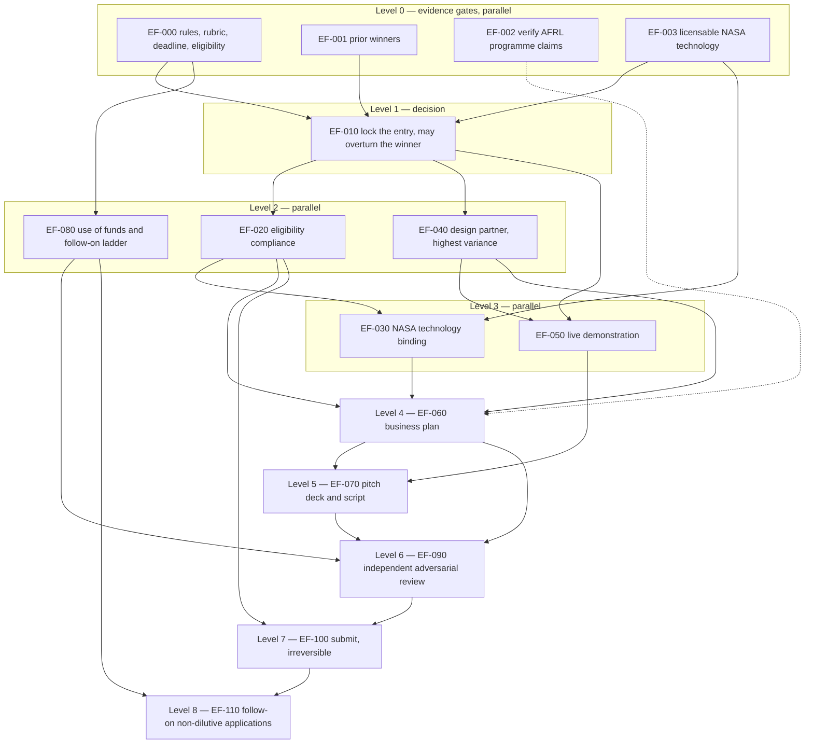

# Expanding Frontiers award tournament — 2026-08-28

GenericPrompt (`prompts/shared/ULTIMATE_SOLUTION_TOURNAMENT.md`) executed against
the SUBJECT: **which venture idea most likely wins a grant or award from
[Expanding Frontiers](https://www.expandingfrontiers.org), the Brownsville, Texas
space-and-energy innovation nonprofit.**

## Read in this order

| File | What it is |
|---|---|
| `FULL_REPORT.md` | The investigation. Start at section 0 for the answer, section 2.1 for where the answer breaks. |
| `DO_THIS_NEXT.md` | The handoff. Exact sessions, models and prompts. |
| `SOURCE_REGISTER.md` | Every source with a confidence level, and the seven obligations that are still open. |
| `EXECUTION_DAG.json` | 15-node execution graph for the winner, with full section-17 node contracts. |
| `TOURNAMENT_RESULTS.json` | Machine-readable scoring: 30 entrants, 4 hybrids, 6 rubric-sensitivity variants. |
| `score_tournament.py` | Regenerates the results. Change the inputs to challenge the ranking. |
| `validate_dag.py` | Checks the DAG for dependency, cycle, level-ordering and contract-completeness defects. |

## Result

| Rank | Idea | Weighted |
|---|---|---|
| 1 | **Frontier Assurance** — a sealed flight recorder for autonomous operations, wedged into offshore booster recovery and cryogenic propellant transfer | 8.79 |
| 2 | **CryoAssay** — propellant-grade LNG certification and boil-off loss accounting for the Brownsville cryo corridor | 8.02 |
| 3 | **Saltline** — Startup-NASA-licensed corrosion and thermal-protection coatings for converted Gulf recovery platforms | 6.84 |

Verdict **ADAPT**: the winner is a hybrid that did not exist before the tournament.
Confidence **medium** and conditional — the sensitivity analysis in section 2.1 flips
the winner to CryoAssay under a hardware-favouring rubric, and obtaining the real
rubric is node `EF-000`, the first thing to do.

## Level graph



Critical path: `EF-000 -> EF-010 -> EF-040 -> EF-060 -> EF-090 -> EF-100`.

## Reproduce

```bash
python docs/plan/expanding-frontiers-tournament-2026-08-28/score_tournament.py
python docs/plan/expanding-frontiers-tournament-2026-08-28/validate_dag.py
```
