# Whitespace and youth tournaments — 2026-08-28

Two more runs of `prompts/shared/ULTIMATE_SOLUTION_TOURNAMENT.md`, answering two
follow-up subjects to the [first run](../expanding-frontiers-tournament-2026-08-28/):

- **Tournament B — WHITESPACE:** ideas essentially nobody is doing.
- **Tournament C — YOUTH:** ideas a high school student can personally pitch and execute.

## Read in this order

| File | What it is |
|---|---|
| `FULL_REPORT.md` | Both investigations. Section 0 for the answers, section 4 for the risk both winners share. |
| `DO_THIS_NEXT.md` | The handoff for both tracks. |
| `SOURCE_REGISTER.md` | Sources S20-S29 with confidence levels, obligations O8-O12, and an upfront warning about the weakest evidence here. |
| `EXECUTION_DAG_VENTURE.json` | 11 nodes for the venture winner. |
| `EXECUTION_DAG_YOUTH.json` | 6 nodes for the youth winner, independent of the venture track. |
| `WHITESPACE_RESULTS.json`, `YOUTH_RESULTS.json` | Machine-readable scoring, 44 entrants total, with sensitivity. |
| `score_tournaments.py`, `validate_dag.py` | Regenerate and check. |

## Results

**Tournament B — nobody else is doing it**

| Rank | Idea | Weighted | Why empty |
|---|---|---|---|
| 1 | **Boom Baseline** — the independent launch overpressure record, the measurement layer every airport has and no spaceport does | 9.12 | `EMPTY_BECAUSE_NEW` |
| 2 | **Peninsula** — one shared risk picture for the launch site, LNG terminal, port and highway on one peninsula | 8.39 | `EMPTY_BECAUSE_UNGLAMOROUS` |
| 3 | **SARGO** — sargassum to rocket-grade biomethane, with arsenic separation as the actual product | 7.79 | `EMPTY_BECAUSE_HARD` |

**Tournament C — a high schooler can pitch this**

| Rank | Idea | Weighted |
|---|---|---|
| 1 | **The Boom Map** — a student-built sensor network publishing the first public record of what each launch does to each street | 9.34 |
| 2 | **Beach Fuel** — jar-scale sargassum to methane, reporting yield and arsenic honestly | 8.58 |
| 3 | **Closure Count** — the door-to-door economic ledger of launch day in Port Isabel | 8.39 |

Nine sensitivity variants were computed across both tournaments and **none changes
either winner**, including a novelty-maximalist rubric and one that removes whitespace
entirely. The first tournament's winner flipped under two of six variants; these do not.

## The emptiness gate

Scoring "nobody is doing it" without asking *why* rewards traps. Every entrant carries
a classification, and two of them disqualify before scoring:

`EMPTY_BECAUSE_NEW` · `EMPTY_BECAUSE_HARD` · `EMPTY_BECAUSE_UNGLAMOROUS` ·
`EMPTY_BECAUSE_GATED` · **`EMPTY_BECAUSE_BAD`** · **`NOT_ACTUALLY_EMPTY`**

Eleven of 44 entrants were disqualified on emptiness, including model rockets,
high-altitude balloons, CubeSat design studies and space-themed tutoring apps — the
four most common high school space projects there are.

## Tracks

```mermaid
graph TD
  subgraph V["Venture track — Boom Baseline"]
    WS000["WS-000 disprove the whitespace claim"]
    WS001["WS-001 ExF alignment: coexistence or adversarial"]
    WS002["WS-002 verify the FAA overprediction finding"]
    WS010["WS-010 lock entry and venue"]
    WS020["WS-020 find one payer — highest variance"]
    WS030["WS-030 consent and privacy framework"]
    WS040["WS-040 build and calibrate, capture a launch"]
    WS050["WS-050 publish the first record — irreversible"]
    WS060["WS-060 submission"]
    WS070["WS-070 independent adversarial review"]
    WS080["WS-080 submit — irreversible"]
    WS000 --> WS010
    WS001 --> WS010
    WS010 --> WS020
    WS010 --> WS030
    WS020 --> WS040
    WS030 --> WS040
    WS040 --> WS050
    WS050 --> WS060
    WS002 --> WS060
    WS060 --> WS070
    WS070 --> WS080
  end
  subgraph Y["Youth track — The Boom Map"]
    YM000["YM-000 SESA dates and project origination"]
    YM010["YM-010 consent and safety, before any hardware"]
    YM020["YM-020 build and calibrate three nodes"]
    YM030["YM-030 recruit 12-15 homes plus the school"]
    YM040["YM-040 capture a launch, publish the map"]
    YM050["YM-050 submit — irreversible"]
    YM000 --> YM010 --> YM020 --> YM030 --> YM040 --> YM050
  end
```

The tracks are deliberately independent so a student is never blocked on the venture.
