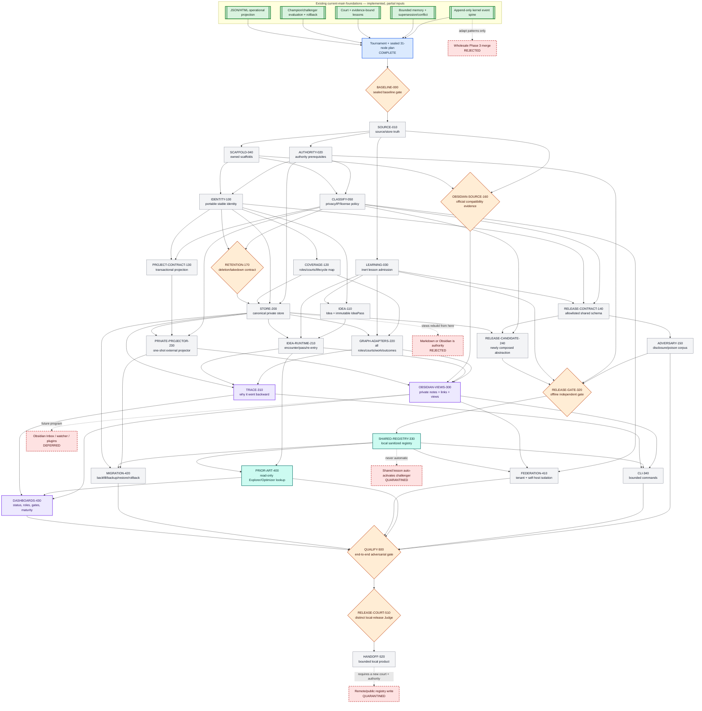
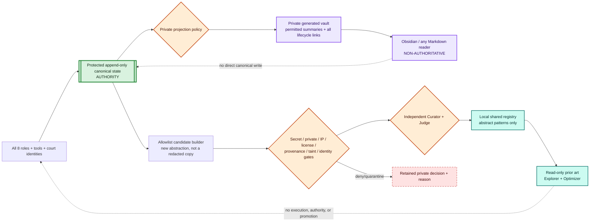

# Visual DAG

## Status legend

- **Green double-border** — implemented prerequisite on current `main`; reusable input,
  not completion of a new node.
- **Blue** — tournament and plan complete in this bundle.
- **Gray** — planned implementation node, not started.
- **Orange hexagon** — fail-closed gate or independent court.
- **Purple** — generated private human/Obsidian-compatible view.
- **Teal** — approved local shared-learning surface.
- **Red dashed** — deferred, rejected, or quarantined behavior outside this plan.

Every implementation node below has status `not_started`. The prior 39-node DAG being
complete does not complete these new contracts.

## Full implementation DAG

## Runtime idea loop — unlimited passes without a cyclic execution DAG

```mermaid
flowchart LR
  I["Stable Idea IDEA-17"] --> P1["IdeaPass 17.1\nimmutable"]
  P1 --> C1{"Court/gate"}
  C1 -->|"adopt/adapt"| W1["Work attempt"]
  W1 --> V1{"Verification"}
  V1 -->|"failure + evidence"| R1["Remand\nreason, gate, actor, evidence"]
  R1 --> P2["IdeaPass 17.2\nimmutable successor"]
  P2 --> C2{"Court/gate"}
  C2 --> D2["Verified delivery"]
  D2 --> O2["Outcome / incident"]
  O2 --> R2["Re-entry trigger\nregression"]
  R2 --> P3["IdeaPass 17.3\nimmutable successor"]
  P3 --> MORE["... any later pass\nwithin leases/stopping policy"]

  R1 -. "semantic return to design/build" .-> W1
  R2 -. "semantic return to discovery/court" .-> C1

  classDef idea fill:#dbeafe,stroke:#2563eb,color:#102a43;
  classDef pass fill:#f3f4f6,stroke:#6b7280,color:#111827;
  classDef gate fill:#ffedd5,stroke:#c2410c,stroke-width:2px,color:#431407;
  classDef return fill:#fef3c7,stroke:#a16207,color:#422006;
  class I idea;
  class P1,P2,P3,W1,D2,O2,MORE pass;
  class C1,V1,C2 gate;
  class R1,R2 return;
```

The dotted arrows explain the conceptual backward movement. The durable chronology is
the solid left-to-right chain, so point-in-time replay and DAG scheduling remain valid.

## Private and shared write boundary

