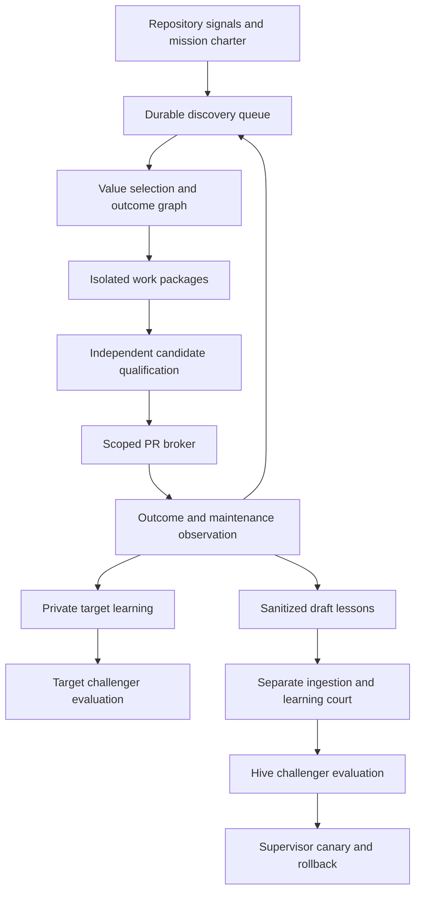

# Implementation runbook

## 1. Scope and controlling interpretation

This is a successor design for the entire operating lifecycle, not a request to loosen a single prompt. The latest owner instruction is to produce an extremely detailed handoff and **not implement code**. It overrides the tournament template's instruction to install and execute a control plane now. Do not run `Invoke-PreauthorizedContinuation.ps1 -Apply`, activate a tournament, create host grants, or dispatch implementation from this documentation task.

The future system must:

- Operate continuously after installation and explicit standing configuration, discovering, ranking, implementing, verifying, delivering, maintaining and learning without routine human coordination.
- Work on itself and separately configured external repositories, with no ambient access to unrelated repositories.
- Generate production candidates, not merely plausible diffs, and open its own scoped PRs.
- Optimize independently accepted useful outcomes per cost and elapsed time. Number of agents, lines changed, PRs opened and tokens consumed are diagnostics, not success rewards.
- Let builders choose implementation details and repair locally without repeated planning ceremonies.
- Improve Hive strategies and target-app strategies through distinct, versioned learning routes.
- Create a draft lessons artifact for completed external-app runs. Upstream Hive contributions contain learning prose only, never target code, assets, logs, secrets or private state.
- Support endpoint reconstruction from first/final commits plus an explicitly classified README, and retain strict point-in-time replay as a separate mode.
- Support Roblox through a domain adapter with actual engine, multiplayer, security, performance and asset evidence.

No claim of universal autonomous competence is made. A mission can end in a qualified candidate, a truthful no-change decision, a recoverable failure, or an explicit external capability obligation. Finite resources and an operator kill switch are installation properties, not repeated approvals during authorized routine work. The system may propose new goals inside its configured mission charter; it cannot expand its own credentials, spending, tenancy, protected branches or deployment scope.

### Fixed interpretation decisions

| Question | Implementation decision |
|---|---|
| Does "won't check in code" prohibit external-app development? | No. It applies to the external app's learning contribution to Hive. The target gets its own code PR. |
| Is draft merely a filename? | No: document DRAFT status, forge draft PR, and exclusion from active memory/challenger inputs are separate requirements. |
| Is the final README allowed? | Yes as an explicitly supplied current product brief, labelled endpoint reconstruction. It is not historical evidence available at the first commit. |
| Does learning require model weight training? | No. Start with validated memories, prompts, tools and strategies; weight training is a later separately evaluated adapter. |
| Can a role be accounted for without a fresh model call? | Yes when its applicable check is deterministic or valid prior evidence is consumed under the existing applicability policy. An absent required role is never invented as completed. |
| Must every node have its own full court? | No. A campaign decision covers its adopted claims; material new claims or changed boundaries reopen that decision. Builder edits within the selected contract do not. |
| Does opening a PR imply merging or deploying? | No. Each is its own configured authority. Default delivery is a draft code PR, later marked ready only after its qualification receipt. |
| Can the OS update its running process? | A self-change is a challenger build. An external supervisor activates a qualified version at a checkpoint and can restore the prior version. |

## 2. Baseline facts and the selected direction

Read the source at the recorded baseline before changing it; line numbers are locators and may drift. The current repository is a substantial substrate, but its independently tested pieces do not prove an integrated autonomous product.

| Observed surface | Existing behavior | Required change |
|---|---|---|
| `tournament_plan_factory.py`, `local_dag_runtime.py` | Real thirteen-stage plan and local execution, but runtime instructs at most three ideas and one small improvement | Add a versioned campaign profile and multiple work packages, preserving local-only compatibility |
| `brain_kernel/mission_runtime.py` | Fixed serial roles and `candidate/app.txt` builder path in local composition | Bind a real graph, repository paths and product checks |
| `workers.py` | Canonical binding provider seam has no production registration call found | Persist trusted configuration and construct bindings on every worker process startup |
| `scheduler.py`, `campaign_continuity.py` | Queue leases, retries and continuity primitives | Compose them into one authoritative service and recovery path |
| `task_reuse.py`, `test_result_cache.py`, `context_capsule.py` | Useful primitives without runtime call sites found | Wire them into admission, context assembly and checks |
| `cortex/github/delivery_adapter.py` | Controlled branch push and draft PR operations | Bind qualified candidate receipts to a delivery broker with reconciliation |
| `brain_kernel/learning_runtime.py` | Scoped lessons and challenger foundations | Add tenant enforcement and non-active export draft lifecycle |
| `pit_oracle.py` | Sealed history replay with changed-path grading | Add endpoint-only inputs and functional evaluators |
| `verification_adapters.py` | Python/Node/Go checks, Rust compile-only adapter, trusted-local sandbox | Add explicit hard-isolation and real domain runtime capabilities |

Proposed architecture: a **durable repository service with flexible work packages and separate learning boundaries**. This is the provisional design selected by the analytical tournament, subject to the independent design review and future measured tournament. It combines existing queue/recovery and evidence infrastructure with a small builder loop; it does not replace the kernel with a new framework.

One durable store owns mission state. Existing evidence stores may retain their append-only events, but the mission controller must derive its transitions from one declared event/receipt boundary. `.autopilot` is an implementation control plane; it is not an application runtime dependency. A published game or app runs independently when Hive is stopped.

### Proposed architecture decisions to record in N01

Create new ADRs using the next available numbers at implementation time. Do not renumber or silently rewrite ADR-074 through ADR-078.

1. General campaign topology with flexible local execution; preserve direct agent ownership and the external DAG boundary.
2. One durable runtime composition and separately granted PR delivery; preserve existing local-only plans.
3. Tenant-bound memory, model context, artifacts and draft-only cross-repository learning.
4. Endpoint reconstruction alongside strict PIT; distinct learning and untouched evaluation splits.
5. Risk-based check scheduling with content-bound reuse and independent qualification.

Each ADR includes the original requirement IDs, alternative considered, advocate argument, examiner objection, expert testimony, independent disposition, tests, migration and rollback. These are proposed decisions; this file does not amend policy or confer execution authority.

## 3. Common contracts — exact implementation targets

These are **proposed version-1 contracts**, not assertions that the symbols already exist. Prefer adapting existing dataclasses and schemas to parallel replacements. Fields called digests use the repository's canonical digest routines. A model cannot supply a trusted tenant identity, authority digest, attestation or accepted test result simply by writing it into JSON.

### C01 SubjectBoundary and repository profile

Required immutable fields: `schema_version`, `tenant_id`, `repository_id`, `subject_kind` (`hive_os|external_app`), `base_commit`, `base_tree_digest`, `target_ref`, `workspace_root_id`, `private_store_id`, `memory_partition_id`, `authority_digest`, `export_policy_digest`, `tool_profile_digest`. Bind tenant and repository through trusted configuration. Remote URLs and local common Git directories are observations, not universal stable tenant identities.

Profile fields: build adapters, permitted network destinations, environment-variable names, secret **handles**, resource lease, provider-data policy, generated-path policy, protected refs, code-delivery destination, lessons destination, and production acceptance profile. Reject missing identity, path escapes, unknown profiles and mutable bindings. Resolve symlinks, reparse points, Git alternates, submodule paths and case aliases before mounts/writes. Same repository names under two tenants are different subjects.

### C02 MissionSpec and WorkPackage

MissionSpec fields: `mission_id`, `revision`, `subject_boundary_digest`, `goal`, `origin_signal_refs`, `acceptance_profile_digest`, `selected_problem_case`, `risk_class`, `budget_lease_id`, `graph_digest`, `stop_conditions`, `outcome_window`, `created_at`. The charter is trusted input. Proposal descriptions are untrusted data.

WorkPackage fields: `node_id`, `revision`, `mission_id`, `objective`, `requirement_ids`, `dependencies`, `input_refs`, `output_contracts`, `read_scope`, `write_scope`, `semantic_locks`, `acceptance_ids`, `risk_class`, `minimum_route`, `budget_allocation`, `rollback_recipe`, `completion_rule`. No arbitrary shell command from a generated profile executes without a configured adapter/command binding.

The package fixes outcomes, interfaces and effect boundaries. The builder may reorder steps, add helpers and tests, refactor within its write surface, batch commands and choose algorithms. It may propose a successor contract if needed. The successor retains node lineage and does not retroactively authorize prior effects.

### C03 GraphRevision and event state

A revision contains parent graph digest, added/superseded nodes, changed edges, unchanged requirement mapping, affected work, reason and independent decision references where required. Reject cycles, orphaned adopted requirements, deleted dissent and acceptance weakening. Already running packages retain their claimed contract unless safely checkpointed and explicitly superseded.

Mission states: `REGISTERED → ADMITTED → READY → RUNNING → CANDIDATE_READY → VERIFYING → QUALIFIED → DELIVERY_PENDING → PR_OPEN → OBSERVING → CLOSED`. Repair returns from verification/CI to a successor `READY` package. Orthogonal states: `WAITING_DEPENDENCY`, `WAITING_CAPACITY`, `RECOVERY_REQUIRED`, `BLOCKED_AUTHORITY`, `BLOCKED_CAPABILITY`, `QUARANTINED`, `CANCELLED`. A PR is delivered before it is merged; acceptance evidence and integration ancestry decide completion for implementation-program nodes.

All transitions bind mission revision, node revision, prior event, input snapshot and actor. Use compare-and-swap/fencing through the durable store. Persist intent before effects and observed receipt afterward. On timeout after an external effect, observe remote reality before retrying. An expired lease alone cannot prove that the previous worker stopped.

### C04 ValidationReceipt and reuse

Receipt fields: subject/tenant boundary, candidate commit and tree, check-set digest, toolchain/dependency/image digests, safe-environment digest, sandbox capability digest, executor identity, reviewer/trust domain, start/end times, exit/result status, raw-artifact references, required-check coverage, freshness rules, receipt digest.

A cache key must cover every input that can affect the claim. Bind tests as well as production code, configuration, generated files, dependencies, platform, adapter version and nondeterministic external-state policy. A missing or unknown dependency forces a miss. Immutable test receipts are reusable observations, not reusable independent judgments. Builder receipts cannot satisfy Curator identity requirements. A Curator may reuse its own still-valid receipt for the exact candidate and inputs; it must not relabel a builder receipt. Release qualification remains on the exact integrated candidate required by repository policy.

### C05 ModelRoute and ContextManifest

Route fields: capability tier, provider, effective model ID, supported effort/settings, account availability receipt, data-policy digest, task qualification profile, context/output limits, retry/escalation policy. Context fields: boundary, node and dependency contract digests, selected source bodies, cold references, omitted obligations, memory selection reason, provider destination and measured token count.

Do not ship the whole master runbook or all previous role reports to each worker. A typical first packet is 2,000–6,000 tokens of contract and relevant source, with explicit retrieval when more is needed. This is a soft packing goal, never permission to omit evidence silently. Unavailable native tools select an explicitly qualified packet/patch path or block capability; they do not make an iterative implementation claim true.

### C06 DeliveryIntent

Fields: effect ID, idempotency key, boundary, destination forge/repository, base ref, branch, exact candidate head/tree, qualification receipt, grant digest, staged-path manifest, safe PR title/body digest, draft flag, publication status. Code delivery and lesson export use different intents and credentials. Broker writes only the registered unprotected branch. After push/PR response loss, query by repository, branch and expected head; accept only an exact matching remote object. Never reset an unrelated branch or force-push to fix ownership ambiguity.

### C07 LessonDraft and LearningRoute

LessonDraft is a closed schema: version, opaque draft/run/source tokens, immutable `document_status=DRAFT`, separate `processing_state`, abstract statement, applicability, observed outcome, uncertainty, counterexamples, safe public references, private custody token, provenance disposition, sanitization receipt, export policy, generator/reviewer identities and time. No raw target source, diff, logs, copied code snippets, absolute paths, private URLs, player/customer data, binary payloads or secrets. Private content hashes can identify data and are not automatically public-safe. N20 supplies the canonical field-by-field schema; C07 specifies its required semantics.

Routes: `target_app`, `hive_os`, `export_draft`. An external-origin global-looking lesson still enters `export_draft`; a scope string cannot promote it. A private app challenger may improve the app with its own data while Hive receives no raw data. Draft publication, document merge, lesson adoption and champion activation are four different events.

Export states: `CAPTURED_PRIVATE → CANDIDATE_PRIVATE → SANITIZED_DRAFT → REVIEWED_DRAFT → COMMITTED_DRAFT → DRAFT_PR_OPEN`. Failures: `BLOCKED_EXPORT_DESTINATION`, `BLOCKED_EXPORT_AUTHORITY`, `QUARANTINED_EXPORT`, `EXPORT_FAILED_RETRYABLE`. Completion requires the promised destination artifact, not a locally generated string. If no safe learning exists, record a truthful no-exportable-lesson draft. Never fabricate insight to meet a count. A safe stub can satisfy the artifact format but must retain the non-exported-content obligation.

One mandatory draft obligation belongs to one stable external-app mission/run identity. Polls, retries, repaired candidates, DAG nodes and individual endpoint grades update that obligation's append-only lineage; they do not create a stream of duplicate draft files/PRs. An independently admitted new mission creates a new obligation. Failed or cancelled missions retain a safe outcome stub when required by the configured owner contract; none are silently dropped. Scanners and canaries are defense in depth, not a proof that every possible secret can be recognized.

### C08 EndpointEpisode

Mode is `strict_pit` or `endpoint_reconstruction`. Endpoint fields: episode and source record IDs; first/final commit/tree; README digest/origin; brief visibility (`initial_readme|provided_current_readme|owner_authored_brief`); repository-family ID; `dataset_split` with exact enum `training|development|promotion_holdout`; dependency/asset/fixture manifests; learner/evaluator identities; tool, rubric and budget digests; contamination caveats.

Custodian seals the first snapshot and permitted brief for the learner. Evaluator retains final snapshot and hidden tests. No intermediate history, source remote, final refs, Git alternates, evaluator logs, previously solved cache or network answer lookup reaches the learner. Equal/shared blobs already in the first snapshot are not forbidden merely because the final tree references them. Empty or identical endpoint cases are retained and excluded from improvement claims.

States: `REGISTERED → SOURCE_ADMITTED → INPUT_SEALED → LEARNER_RUNNING → CANDIDATE_SEALED → EVALUATOR_RUNNING → GRADED → LESSON_CANDIDATE`; nonpassing states are `BLOCKED_SOURCE`, `BLOCKED_ENVIRONMENT`, `CONTAMINATED`, `FAILED`, `INCONCLUSIVE`. Full final reveal retires that episode from future fresh holdouts. Evaluation failures return bounded diagnostic categories during development; raw hidden tests are not automatically returned during qualification.

### C09 ProductionAcceptanceProfile

Fields: domain adapter and tool versions, environment digest, required checks, required runtime matrix, measurable performance/resource budgets, security invariants, data migration/rollback tests, asset/license evidence, operational requirements, artifact manifest and release-authority reference. Statuses distinguish `STATIC_VALIDATED`, `RUNTIME_VALIDATED`, `PRODUCTION_CANDIDATE` and `DEPLOYED_OBSERVED`.

Production candidate means all required checks for this declared target profile passed. A compile-only or mocked check cannot satisfy an engine/runtime requirement. Missing Studio access, devices, licensed assets or test data becomes an explicit capability/source obligation. The owner has not supplied an actual Roblox repository, gameplay specification, devices or release account; the adapter must require those mission-specific inputs when such a mission is admitted.

## 4. Efficient execution policy

### Checks occur when their inputs or purpose change

| Boundary | Required work | Repetition trigger |
|---|---|---|
| Campaign admission | Source/authority/profile/schema checks and baseline capture | Bound input, policy, host or source changes |
| Local builder iteration | Relevant unit/static checks and targeted diagnostics | Changed behavior or a new failure hypothesis |
| Package candidate ready | Independent focused qualification of exact candidate | Candidate/check/toolchain/environment changes or new adverse evidence |
| Integration cohort | Cross-package tests and required repository CI gate | New integrated candidate or invalidated result |
| Publication | Fresh authority, revocation, branch/head and staged-byte check | Every actual external effect; deterministic and cheap |
| Learning promotion | Independent held-out/regression/privacy court | New challenger or changed evidence |

The CI gate is `python -m unittest discover -s tests -v`. Bind `PYTHONPATH` to the **absolute admitted worktree's `src` directory for every test shell**, including focused commands in all appendices. Read-only inspection found that the default installed package points at a different worktree. At session startup, set `$env:PYTHONPATH = (Join-Path (Get-Location).Path 'src')` from the admitted worktree and verify `python -c "import hive_mind_os; print(hive_mind_os.__file__)"` resolves inside that exact directory before any test. Record the binding once per shell/environment. Run full CI on the final integrated candidate at the required gate; never replace it with a smaller suite in order to report green. Existing CI may repeat the suite on its own exact checkout, which has a different independent execution purpose. Do not repeatedly run it during every source edit.

Unchanged check results, source reads and completed tasks are reused only when C04/fingerprint validity holds. Cache deterministic artifact bodies in tenant-bound stores. Shared public dependencies require explicitly public classification and immutable digests. Never share target-derived prompts, tool logs or retrieval indexes merely because cache keys collide.

### Model and role policy

Start bounded implementation on the cheapest route that has passed the task-class qualification. Escalate for demonstrated ambiguity, concurrency, security-boundary reasoning or repeated lack of progress. A harder model reviews high-risk boundaries; it does not need to author every mechanical edit.

| Tier | Task | OpenAI initial route | Anthropic initial route | Initial planning allowance |
|---|---|---|---|---|
| T0 | Parsing, hashing, deterministic checks | No model; if prose needed `gpt-5.6-luna`, low | No model; if prose needed `claude-haiku-4-5-20251001`, no effort field | 10k input / 2k output tokens, 15 min |
| T1 | Bounded implementation from a node contract | `gpt-5.6-luna`, medium | `claude-sonnet-5`, supported low effort | 30k cumulative input / 6k output, 45 min |
| T2 | Multi-module integration or diagnosis | `gpt-5.6-terra`, medium | `claude-sonnet-5`, supported medium effort | 60k input / 10k output, 90 min |
| T3 | Isolation, concurrency, promotion, critical review | `gpt-5.6-sol`, high | `claude-opus-5`, supported high effort | 90k input / 12k output, 120 min |

These are **starting hypotheses and planning allowances, not proven minimums or granted budgets**. Resolve provider support/account access through N07; use the provider's actual parameter schema. OpenAI routes are exposed by the current host; Anthropic IDs were checked against its public catalog, which is not account entitlement. Do not silently substitute an unavailable route. The dispatcher can subdivide a package or choose a qualified available model. Catalogs and routes live outside node logic.

Official guidance supports establishing quality targets and evaluating smaller models for reduced cost/latency; no claim is made that a particular small model can implement every node. Sources: [OpenAI model selection](https://developers.openai.com/api/docs/guides/model-selection), [building agents](https://developers.openai.com/tracks/building-agents), [Anthropic model catalog](https://platform.claude.com/docs/en/models/overview).

All eight specialist roles have accountable campaign/mission evidence. Explorer selects a valuable problem; Architect establishes its contract; Builder executes; Curator independently verifies; Integrator verifies composition; Steward checks recovery/operation; Optimizer measures outcomes; Orchestrator owns flow. Use existing applicability dispositions for deterministic checks and legitimate prior evidence. Identity labels alone do not prove independent principals: record session/process and applicable trust-domain evidence, and report the actual independence level.

### Repair and replan

Default one retry for a classified transient infrastructure failure, with jitter/backoff; reconcile uncertain effects before any retry. Permit two focused repair attempts on one acceptance failure set, then require a changed hypothesis, different qualified route, or package revision. These are configurable leased defaults, not a blanket prohibition on solving hard work. Exhaustion checkpoints the task rather than deleting progress or inventing authority.

Local edits, newly added helpers and reordered steps need no new court when outcomes, write boundary, authority and risk remain valid. Replan only on a changed dependency/interface, broader write/authority boundary, altered acceptance, materially new evidence, unresolvable conflict, or no-progress limit. Review only the changed claim and affected evidence. Unaffected nodes retain their receipts.

## 5. Universal node contract and worker procedure

Every node in the appendices inherits this contract. Its explicit details override ordinary implementation suggestions, but cannot weaken admission or acceptance. The node's steps are a concrete first implementation recipe, not an obligation to re-plan after every local variation.

1. Load this section, your node, direct prerequisite receipts, C-contracts referenced by your node and named source sections. Do not reread every historical plan.
2. Reconcile the actual baseline. A path/symbol already implemented with matching tests becomes an evidence-backed reuse/defer decision; do not build duplicate infrastructure. If baseline changed, record a successor source manifest and affected nodes only.
3. Claim the node through the admitted control plane. Use branch `codex/whole-os-nNN-<short-purpose>` unless a collision-safe branch is assigned. Create an isolated worktree. A branch name is not a lock or completion receipt by itself.
4. Read existing tests at the named seam. Write the smallest behavior test that would fail for the required missing capability. A new test file listed here is a future target, not evidence that it exists now.
5. Implement the numbered steps in the appendix. Use existing abstractions. Add dependencies only with version/license/adaptor evidence; do not install a new workflow framework by habit.
6. Run the declared focused command(s), inspect the diff and required output contracts once, and correct relevant failures. Mark skipped/unsupported checks explicitly. Security/authority/learning changes require their negative tests and ADR linkage.
7. Seal the candidate and its receipt. A separate Curator inspects/reproduces applicable claims on the exact candidate. Do not let the builder sign its own approval.
8. Produce a reviewable PR through configured delivery if authorized in the future execution campaign; otherwise preserve an exact local commit/diff and typed publication obligation. Node delivery is distinct from node integration completion.
9. Return the compact receipt and next action; stop at the node's explicit boundary. The dispatcher handles dependents. Do not start a speculative unrelated node because budget remains.

Common evidence receipt: schema version, node/revision, plan/source/contract digests, requirement IDs, starting target commit/tree, candidate commit/tree, branch/PR identity if any, changed paths, model/role identities and usage, tests/checks with raw receipts, acceptance mapping, deviations, source obligations, unresolved risks, rollback and next action. Redacted export receipts reference private custody without copying it.

Common forbidden write scope: protected refs, credentials, unrelated worktrees, raw external-tenant evidence in Hive, existing signed plans/receipts, target/future evaluator data, unrelated policy and production services. New module paths in an appendix are exact proposed locations; if a file already exists when implemented, extend/reconcile it rather than overwrite it.

Common stop: the node's artifacts are sealed, independently assessed and delivered or visibly blocked at its delivery boundary. Completion in the implementation DAG additionally requires valid integration evidence on the intended history, or an explicit compatible dependency-consumption rule from the compiler. Do not infer completion from Markdown, PR titles or green unrelated CI.

Common rollback: revert only the node's isolated implementation commit(s) through normal history, disable its feature flag/configuration, and retain append-only evidence. Never delete task state to clear a blocker. Data migrations use a new version and a reversible reader/pointer transition; do not overwrite old immutable records.

## 6. Dependency flow and parallel work

[dag-index.json](dag-index.json) is the exact dependency inventory. Numbers are identifiers, not artificial execution levels. Priority is: unblock the canonical runtime and safe working loop; wire efficiency; enable qualified PR delivery; then qualify scoped learning and domain breadth. Security-dependent execution waits for its sandbox capability; documentation/schema work can proceed earlier.

The index's `owner_role` is the accountable role and must match the node prose. Its `planning_group` is a navigation label, **not a runtime lock**. N01 compiles every exact semantic lock named in the node and every normalized resolved write-path lock into the executable successor. Refuse launch if that lock set is absent. Thus differing grouping labels cannot allow two workers to write one file.

- Start N00 alone. Then N01 and N02 can proceed independently.
- N03/N04 establish tenant/tool profiles and common mission contracts. N05/N06/N07 then establish context, cache/check policy and model routing.
- N08/N09/N18 can proceed in separate worktrees after their inputs are available. Serialize overlapping contract/CLI files through their semantic locks.
- N10/N12 and N19/N22/N26 unlock the service, roles and domain/curriculum work. N11 adds autonomous discovery.
- N13 and N14 establish real implementation and independent verification. N15 provides scoped publication; N16 closes the feedback loop.
- N20/N21 add draft learning export. N23/N24/N25 add hidden endpoint evaluation and learned challengers. N17 uses that promotion path for self-upgrades.
- N27 qualifies Roblox runtime evidence. N28 composes generic and domain contracts; N29 attacks the integrated boundaries.
- N30 runs the measured tournament only after candidates/harnesses exist. N31 and N32 are separate self/external pilots. N33 closes the measured outcome window.

No implementation lane writes a shared file concurrently. Worktrees may modify disjoint files in parallel; integrations touching `runtime_contracts.py`, `portable_plan.py`, `cli.py`, memory schemas or deployment composition acquire a named semantic lock and rebase/qualify in order. Read-only evidence, source packets and already sealed interfaces can be shared within their boundary. Queue ready work immediately when true prerequisites and locks allow; do not wait for a numeric wave to finish.

## 7. Metrics and measurable exit conditions

N02 freezes the benchmark protocol before challenger tuning. Report all eligible attempts, including failures, timeouts, no-change outcomes and blocked runs with reason categories. Do not drop losing benchmarks. Use pinned task families, prompts, models, budget, dependencies, environment and tool permissions for matched comparisons.

Primary measures: independently accepted functional tasks / eligible tasks; critical/major escaped defects; unauthorized effects and cross-boundary disclosure; unattended recovery success; successful scoped PR delivery; target-specific production checks. Secondary measures among passing candidates: total provider cost, cumulative input/output/cache/reasoning tokens where exposed, elapsed and active time, queue wait, repeated-test time, repeated context bytes, number of model calls, repair cycles and useful accepted changes per resource unit.

Initial experiment targets (hypotheses to test, not achieved facts): at least 25% lower median token cost and 20% lower median active elapsed time than the pinned existing campaign on eligible comparable tasks, with no critical security regression; ordinary task success noninferiority margin 5 percentage points; zero observed tenant/export/PIT violations. Use paired repo-family analysis and report uncertainty. Small samples cannot prove zero risk or noninferiority. Freeze the statistical recipe in N02 and apply N30's inconclusive outcome when evidence is inadequate.

Production maturity is reported by subject/profile. A self-PR pilot is not an external-tenant qualification. A Roblox static build is not a production game. A successful training episode is not a held-out win. A generated plan is not autonomous execution. The final evidence must prove the integrated workflow, including restart and failure paths, against real configured subjects.

## 8. Copy-ready implementation handoff prompt

> Implement only the node assigned by the admitted successor campaign for `docs/plan/whole-os-tournament-2026-09-13`. Read RUNBOOK section 5, your node, and its direct prerequisite receipts. Reconcile actual source before editing. Use the lowest qualified route for the node and its isolated branch. Follow the concrete steps, choosing local implementation details freely inside the contract. Run focused checks during work, then obtain independent exact-candidate verification. Record requirements, sources, changed paths, tests, cost, deviations and rollback. Deliver through the configured scoped broker and stop. If inputs change, preserve evidence and request a successor package from the dispatcher; do not ask the owner to coordinate routine repairs. Do not treat this Markdown or its JSON index as execution authority.

## 9. Definition of done for this handoff versus implementation

This handoff is complete when the requirement map, source register, analytical tournament, implementation node contracts, dependencies and independent review are present and internally consistent. Validation consists of documentation/data checks and review, not fabricated software test results.

The future operating-system enhancement is complete only after N33: all adopted requirements are traceable to integrated receipts; every role/stage has actual applicable evidence; domain and tenant boundaries pass; full CI and integrated failure tests pass; independent benchmark court records a measured verdict; self and external pilots demonstrate unattended operation; required external drafts are delivered or explicitly retained as unresolved obligations; migrations and rollback drills work; and outcome windows show useful behavior. Open source/asset/runtime obligations cannot be relabelled completed. Merge/deployment remain governed by their existing externally configured authority.
